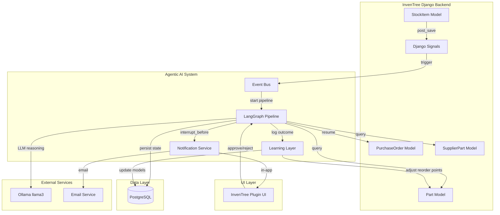
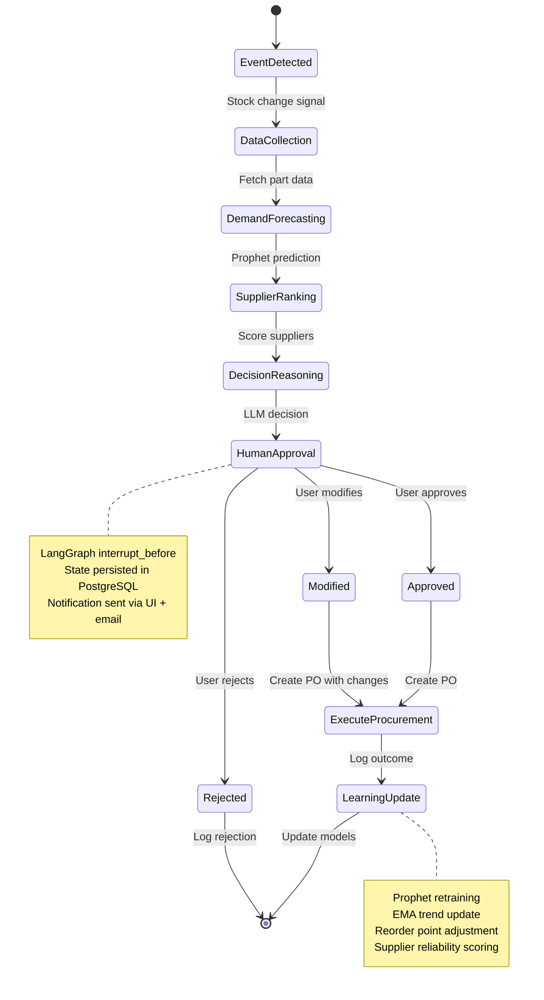
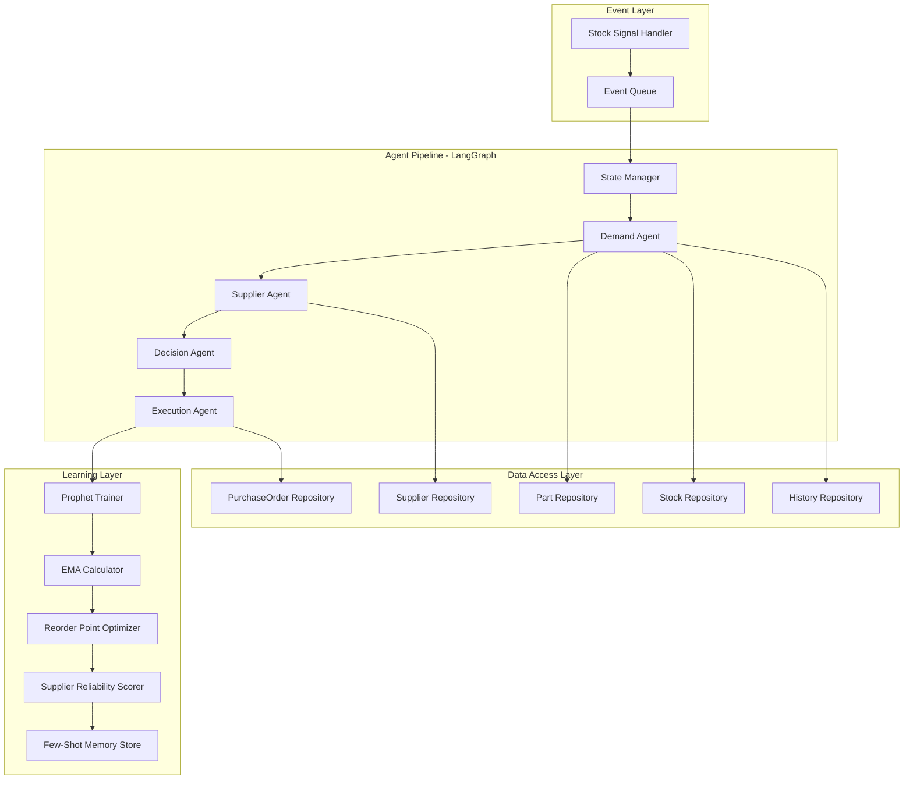
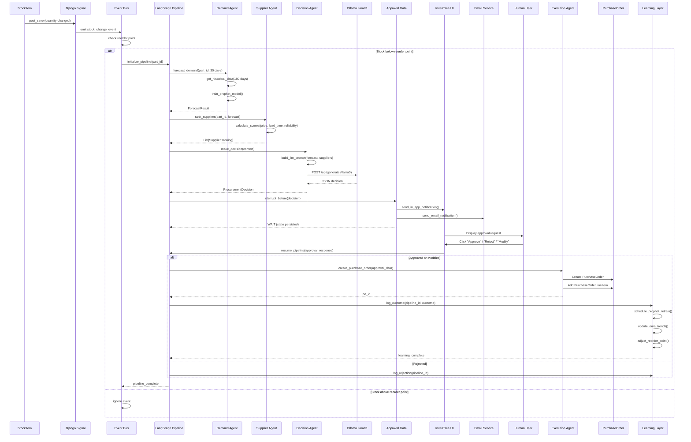
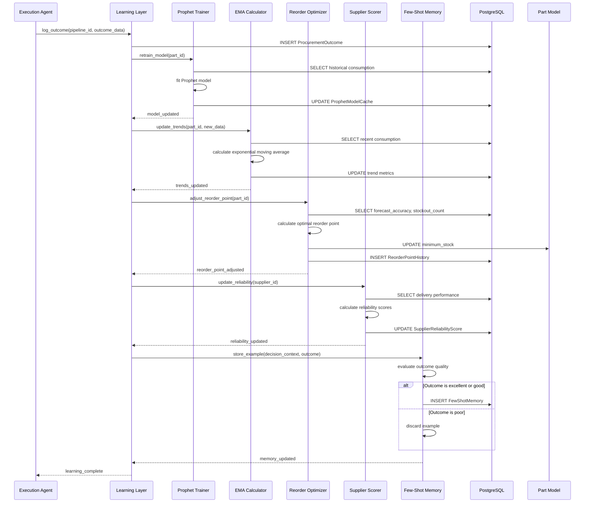

# Design Document: Agentic AI Inventory Management System

## Overview

This design transforms InvenTree's basic AI procurement feature into a fully autonomous, event-driven inventory management system. The system leverages LangGraph for multi-agent orchestration, Prophet for demand forecasting, and Ollama (llama3) for intelligent decision-making. Unlike the current manual-trigger implementation, this agentic system operates autonomously through Django signals, continuously monitors inventory levels, predicts demand, evaluates suppliers, and generates procurement recommendations with human-in-the-loop approval gates.

The architecture implements a true agentic workflow where stock changes automatically trigger a sophisticated pipeline of specialized agents: Demand Agent (Prophet + XGBoost), Supplier Agent (multi-criteria ranking), Decision Agent (LLM reasoning), and Execution Agent (PurchaseOrder creation). The system includes continuous learning capabilities through Prophet retraining, exponential moving averages for trend detection, and dynamic reorder point adjustment. All state is persisted in PostgreSQL using LangGraph's checkpointer, enabling production-grade interrupt/resume capabilities across system restarts.

Key innovation: The system closes the feedback loop by learning from historical procurement outcomes, adjusting its own reorder triggers, and improving forecast accuracy over time without requiring model fine-tuning.

## Architecture

### System Context Diagram



### LangGraph State Machine



### Component Architecture




## Components and Interfaces

### Component 1: Event Bus & Signal Handler

**Purpose**: Detects stock changes and triggers the agentic pipeline automatically

**Interface**:
```pascal
INTERFACE EventBusInterface
  PROCEDURE register_signal_handler(signal_type, handler_function)
  PROCEDURE emit_event(event_type, event_data)
  PROCEDURE get_pending_events() RETURNS event_list
END INTERFACE

INTERFACE SignalHandlerInterface
  PROCEDURE on_stock_change(stock_item, change_type)
  PROCEDURE should_trigger_pipeline(part, current_stock, reorder_point) RETURNS boolean
  PROCEDURE create_pipeline_event(part_id, trigger_reason) RETURNS event
END INTERFACE
```

**Responsibilities**:
- Listen to Django post_save signals on StockItem model
- Evaluate if stock level crosses dynamic reorder point
- Create pipeline trigger events with context
- Queue events for asynchronous processing
- Handle signal deduplication to prevent duplicate triggers

**Integration Points**:
- Django signals: `post_save` on `stock.models.StockItem`
- Django signals: `post_save` on `order.models.SalesOrderLineItem`
- LangGraph pipeline initialization

### Component 2: LangGraph State Manager

**Purpose**: Orchestrates multi-agent workflow with stateful execution and interrupt/resume capabilities

**Interface**:
```pascal
INTERFACE StateManagerInterface
  PROCEDURE initialize_pipeline(part_id, trigger_context) RETURNS pipeline_id
  PROCEDURE get_pipeline_state(pipeline_id) RETURNS state
  PROCEDURE update_state(pipeline_id, new_state)
  PROCEDURE interrupt_pipeline(pipeline_id, interrupt_reason)
  PROCEDURE resume_pipeline(pipeline_id, human_decision)
  PROCEDURE persist_checkpoint(pipeline_id, state)
  PROCEDURE load_checkpoint(pipeline_id) RETURNS state
END INTERFACE

STRUCTURE PipelineState
  pipeline_id: UUID
  part_id: Integer
  current_node: String
  agent_outputs: Dictionary
  human_decision: Dictionary OR NULL
  created_at: Timestamp
  updated_at: Timestamp
  status: String  // "running", "interrupted", "completed", "failed"
END STRUCTURE
```

**Responsibilities**:
- Define LangGraph workflow graph structure
- Manage state transitions between agent nodes
- Persist state to PostgreSQL using LangGraph checkpointer
- Handle interrupt_before for human approval gate
- Resume execution after human input
- Provide state recovery after system restarts

**Integration Points**:
- LangGraph library for graph definition
- PostgreSQL for state persistence
- All agent components as graph nodes
- Notification service for interrupt handling

### Component 3: Demand Agent

**Purpose**: Forecasts future demand using Prophet with XGBoost fallback

**Interface**:
```pascal
INTERFACE DemandAgentInterface
  PROCEDURE forecast_demand(part_id, forecast_days) RETURNS forecast_result
  PROCEDURE get_historical_data(part_id, lookback_days) RETURNS dataframe
  PROCEDURE train_prophet_model(historical_data) RETURNS model
  PROCEDURE fallback_to_xgboost(historical_data) RETURNS model
  PROCEDURE calculate_confidence_interval(forecast) RETURNS confidence_bounds
END INTERFACE

STRUCTURE ForecastResult
  part_id: Integer
  forecast_horizon_days: Integer
  predicted_demand: Decimal
  confidence_lower: Decimal
  confidence_upper: Decimal
  model_used: String  // "prophet" or "xgboost"
  seasonality_detected: Boolean
  trend_direction: String  // "increasing", "decreasing", "stable"
  forecast_accuracy_score: Decimal
END STRUCTURE
```

**Responsibilities**:
- Aggregate historical stock movements from InvenTree
- Transform data into Prophet-compatible format (ds, y columns)
- Train Prophet model with seasonality detection
- Generate demand forecast with confidence intervals
- Fallback to XGBoost if Prophet fails or data insufficient
- Calculate forecast accuracy metrics
- Store forecast results in pipeline state

**Integration Points**:
- `stock.models.StockItem` for current stock levels
- `stock.models.StockItemTracking` for historical movements
- `order.models.SalesOrderLineItem` for sales history
- `build.models.Build` for production consumption
- Prophet library for time-series forecasting
- XGBoost library for fallback predictions

### Component 4: Supplier Agent

**Purpose**: Ranks suppliers using multi-criteria decision analysis

**Interface**:
```pascal
INTERFACE SupplierAgentInterface
  PROCEDURE rank_suppliers(part_id, required_quantity) RETURNS ranked_suppliers
  PROCEDURE calculate_supplier_score(supplier, criteria_weights) RETURNS score
  PROCEDURE get_supplier_reliability(supplier_id) RETURNS reliability_score
  PROCEDURE check_moq_constraints(supplier, quantity) RETURNS boolean
  PROCEDURE estimate_total_cost(supplier, quantity) RETURNS cost_breakdown
END INTERFACE

STRUCTURE SupplierRanking
  supplier_id: Integer
  supplier_name: String
  overall_score: Decimal
  price_score: Decimal
  lead_time_score: Decimal
  reliability_score: Decimal
  moq_met: Boolean
  unit_price: Decimal
  total_cost: Decimal
  estimated_delivery_days: Integer
  ranking_position: Integer
  recommendation_reason: String
END STRUCTURE

STRUCTURE CriteriaWeights
  price_weight: Decimal  // default 0.4
  lead_time_weight: Decimal  // default 0.3
  reliability_weight: Decimal  // default 0.3
END STRUCTURE
```

**Responsibilities**:
- Query all suppliers for the given part
- Calculate multi-criteria scores (price, lead time, reliability)
- Apply configurable weights to criteria
- Check MOQ (Minimum Order Quantity) constraints
- Estimate total cost including shipping
- Rank suppliers by overall score
- Generate human-readable recommendation reasoning

**Integration Points**:
- `company.models.SupplierPart` for supplier-part relationships
- `company.models.Company` for supplier details
- Learning Layer for historical reliability scores
- Pricing data from SupplierPart model

### Component 5: Decision Agent

**Purpose**: Uses Ollama llama3 to reason about procurement decisions with plain-English explanations

**Interface**:
```pascal
INTERFACE DecisionAgentInterface
  PROCEDURE make_decision(context) RETURNS decision
  PROCEDURE build_llm_prompt(part_data, forecast, suppliers) RETURNS prompt
  PROCEDURE call_ollama(prompt, model_name) RETURNS llm_response
  PROCEDURE parse_llm_output(response) RETURNS structured_decision
  PROCEDURE validate_decision(decision) RETURNS boolean
  PROCEDURE add_few_shot_examples(prompt, memory_store) RETURNS enhanced_prompt
END INTERFACE

STRUCTURE DecisionContext
  part_id: Integer
  part_name: String
  current_stock: Decimal
  minimum_stock: Decimal
  forecasted_demand: Decimal
  confidence_interval: Tuple
  top_suppliers: List[SupplierRanking]
  recent_stockouts: Integer
  average_consumption_rate: Decimal
END STRUCTURE

STRUCTURE ProcurementDecision
  decision: String  // "ORDER", "DO_NOT_ORDER", "ESCALATE"
  recommended_quantity: Integer
  recommended_supplier_id: Integer OR NULL
  reasoning: String
  confidence_level: String  // "high", "medium", "low"
  risk_factors: List[String]
  alternative_actions: List[String]
END STRUCTURE
```

**Responsibilities**:
- Synthesize data from Demand and Supplier agents
- Build comprehensive context prompt for LLM
- Include few-shot examples from memory store
- Call Ollama API with llama3 model
- Parse JSON-formatted LLM response
- Validate decision logic and constraints
- Generate human-readable reasoning
- Handle LLM failures gracefully

**Integration Points**:
- Ollama API (local, via http://host.docker.internal:11434)
- Few-Shot Memory Store from Learning Layer
- Demand Agent output
- Supplier Agent output


### Component 6: Human-in-the-Loop Approval Gate

**Purpose**: Pauses pipeline execution for human review and approval

**Interface**:
```pascal
INTERFACE ApprovalGateInterface
  PROCEDURE create_approval_request(pipeline_id, decision) RETURNS request_id
  PROCEDURE send_notifications(request_id, recipients)
  PROCEDURE wait_for_approval(request_id) RETURNS approval_response
  PROCEDURE process_approval(request_id, user_action) RETURNS resume_data
  PROCEDURE handle_timeout(request_id, timeout_action)
END INTERFACE

STRUCTURE ApprovalRequest
  request_id: UUID
  pipeline_id: UUID
  part_id: Integer
  decision: ProcurementDecision
  forecast_summary: ForecastResult
  supplier_summary: SupplierRanking
  created_at: Timestamp
  expires_at: Timestamp
  status: String  // "pending", "approved", "rejected", "modified", "expired"
END STRUCTURE

STRUCTURE ApprovalResponse
  request_id: UUID
  user_id: Integer
  action: String  // "approve", "reject", "modify"
  modified_quantity: Integer OR NULL
  modified_supplier_id: Integer OR NULL
  user_notes: String
  responded_at: Timestamp
END STRUCTURE
```

**Responsibilities**:
- Create approval request with full context
- Trigger LangGraph interrupt_before
- Send in-app notification to InvenTree UI
- Send email notification to responsible users
- Wait for human response (non-blocking)
- Process approval, rejection, or modification
- Resume pipeline with human decision
- Handle timeout scenarios

**Integration Points**:
- LangGraph interrupt_before mechanism
- InvenTree notification system
- SMTP email service
- InvenTree plugin UI for approval interface
- User authentication and permissions

### Component 7: Execution Agent

**Purpose**: Creates PurchaseOrders in InvenTree after approval

**Interface**:
```pascal
INTERFACE ExecutionAgentInterface
  PROCEDURE create_purchase_order(approval_data) RETURNS po_id
  PROCEDURE add_line_items(po_id, items)
  PROCEDURE set_po_metadata(po_id, metadata)
  PROCEDURE validate_po_creation(po_data) RETURNS validation_result
  PROCEDURE handle_creation_failure(error, retry_count)
END INTERFACE

STRUCTURE PurchaseOrderData
  supplier_id: Integer
  description: String
  line_items: List[LineItem]
  status: Integer  // 10 = Pending/Draft
  metadata: Dictionary
  created_by_agent: Boolean
  pipeline_id: UUID
  approval_request_id: UUID
END STRUCTURE

STRUCTURE LineItem
  supplier_part_id: Integer
  quantity: Decimal
  reference: String
  notes: String
END STRUCTURE
```

**Responsibilities**:
- Validate approval data completeness
- Create PurchaseOrder in InvenTree database
- Add line items with correct quantities
- Set metadata linking to pipeline execution
- Handle creation errors with retry logic
- Log successful PO creation
- Trigger learning layer update

**Integration Points**:
- `order.models.PurchaseOrder` Django model
- `order.models.PurchaseOrderLineItem` Django model
- `company.models.SupplierPart` for part-supplier linkage
- Learning Layer for outcome logging

### Component 8: Learning Layer

**Purpose**: Continuously improves system performance through model retraining and parameter optimization

**Interface**:
```pascal
INTERFACE LearningLayerInterface
  PROCEDURE log_procurement_outcome(pipeline_id, outcome_data)
  PROCEDURE retrain_prophet_model(part_id)
  PROCEDURE update_ema_trends(part_id, new_consumption_data)
  PROCEDURE adjust_reorder_point(part_id, forecast_accuracy)
  PROCEDURE update_supplier_reliability(supplier_id, delivery_performance)
  PROCEDURE store_few_shot_example(decision_context, outcome)
  PROCEDURE get_few_shot_examples(part_category, limit) RETURNS examples
END INTERFACE

STRUCTURE ProcurementOutcome
  pipeline_id: UUID
  part_id: Integer
  po_id: Integer OR NULL
  decision_made: String
  quantity_ordered: Decimal
  supplier_used: Integer OR NULL
  forecast_demand: Decimal
  actual_demand: Decimal OR NULL  // filled later
  forecast_error: Decimal OR NULL
  delivery_on_time: Boolean OR NULL
  outcome_timestamp: Timestamp
END STRUCTURE

STRUCTURE ReorderPointAdjustment
  part_id: Integer
  old_reorder_point: Decimal
  new_reorder_point: Decimal
  adjustment_reason: String
  forecast_accuracy: Decimal
  stockout_count: Integer
  adjustment_timestamp: Timestamp
END STRUCTURE
```

**Responsibilities**:
- Log all pipeline executions and outcomes
- Retrain Prophet models with new consumption data
- Calculate exponential moving averages for trends
- Dynamically adjust reorder points based on accuracy
- Track supplier delivery performance
- Maintain few-shot memory for LLM context
- Provide analytics on system performance

**Integration Points**:
- PostgreSQL for outcome storage
- Prophet library for model retraining
- Part model for reorder point updates
- Decision Agent for few-shot examples

### Component 9: Notification Service

**Purpose**: Delivers approval requests to humans via multiple channels

**Interface**:
```pascal
INTERFACE NotificationServiceInterface
  PROCEDURE send_in_app_notification(user_id, notification_data)
  PROCEDURE send_email_notification(email_address, notification_data)
  PROCEDURE format_notification_message(approval_request) RETURNS message
  PROCEDURE get_responsible_users(part_id) RETURNS user_list
  PROCEDURE mark_notification_read(notification_id, user_id)
END INTERFACE

STRUCTURE NotificationData
  notification_id: UUID
  notification_type: String  // "approval_request"
  title: String
  message: String
  action_url: String
  priority: String  // "high", "medium", "low"
  expires_at: Timestamp
  metadata: Dictionary
END STRUCTURE
```

**Responsibilities**:
- Format approval requests into readable messages
- Determine responsible users from Part ownership
- Send in-app notifications to InvenTree UI
- Send email notifications via SMTP
- Track notification delivery status
- Handle notification read/unread state

**Integration Points**:
- InvenTree notification system
- SMTP email service (self-hosted)
- Part model for responsible_owner field
- InvenTree plugin UI for notification display

### Component 10: InvenTree Plugin UI

**Purpose**: Provides native UI integration for approval workflow

**Interface**:
```pascal
INTERFACE PluginUIInterface
  PROCEDURE render_approval_panel(part_id) RETURNS html
  PROCEDURE handle_approval_action(request_id, action, user_data)
  PROCEDURE display_pipeline_status(pipeline_id) RETURNS status_view
  PROCEDURE show_forecast_visualization(forecast_data) RETURNS chart
  PROCEDURE show_supplier_comparison(suppliers) RETURNS table
END INTERFACE
```

**Responsibilities**:
- Render approval UI within InvenTree part detail page
- Display forecast charts and supplier comparisons
- Capture user approval/rejection/modification
- Show pipeline execution status
- Provide historical decision log view

**Integration Points**:
- InvenTree plugin system
- React/TypeScript frontend components
- Django REST API endpoints
- LangGraph state manager for resume


## Data Models

### Model 1: PipelineExecution

```pascal
STRUCTURE PipelineExecution
  id: UUID PRIMARY_KEY
  part_id: Integer FOREIGN_KEY(Part)
  trigger_reason: String
  trigger_timestamp: Timestamp
  status: String  // "running", "interrupted", "completed", "failed", "rejected"
  current_node: String
  state_data: JSONB
  created_at: Timestamp
  updated_at: Timestamp
  completed_at: Timestamp OR NULL
  error_message: String OR NULL
END STRUCTURE
```

**Validation Rules**:
- `part_id` must reference valid Part in InvenTree
- `status` must be one of defined enum values
- `trigger_timestamp` cannot be in future
- `state_data` must be valid JSON

**Indexes**:
- Index on `part_id` for quick lookup
- Index on `status` for filtering active pipelines
- Index on `created_at` for time-based queries

### Model 2: DemandForecast

```pascal
STRUCTURE DemandForecast
  id: UUID PRIMARY_KEY
  pipeline_id: UUID FOREIGN_KEY(PipelineExecution)
  part_id: Integer FOREIGN_KEY(Part)
  forecast_horizon_days: Integer
  predicted_demand: Decimal(19, 6)
  confidence_lower: Decimal(19, 6)
  confidence_upper: Decimal(19, 6)
  model_used: String
  seasonality_detected: Boolean
  trend_direction: String
  forecast_accuracy_score: Decimal(5, 4) OR NULL
  created_at: Timestamp
END STRUCTURE
```

**Validation Rules**:
- `predicted_demand` >= 0
- `confidence_lower` <= `predicted_demand` <= `confidence_upper`
- `forecast_horizon_days` > 0
- `model_used` in ["prophet", "xgboost"]
- `forecast_accuracy_score` between 0 and 1 if not NULL

### Model 3: SupplierEvaluation

```pascal
STRUCTURE SupplierEvaluation
  id: UUID PRIMARY_KEY
  pipeline_id: UUID FOREIGN_KEY(PipelineExecution)
  supplier_id: Integer FOREIGN_KEY(Company)
  part_id: Integer FOREIGN_KEY(Part)
  overall_score: Decimal(5, 4)
  price_score: Decimal(5, 4)
  lead_time_score: Decimal(5, 4)
  reliability_score: Decimal(5, 4)
  moq_met: Boolean
  unit_price: Decimal(19, 6)
  total_cost: Decimal(19, 6)
  estimated_delivery_days: Integer
  ranking_position: Integer
  recommendation_reason: Text
  created_at: Timestamp
END STRUCTURE
```

**Validation Rules**:
- All score fields between 0 and 1
- `unit_price` > 0
- `total_cost` >= `unit_price`
- `estimated_delivery_days` >= 0
- `ranking_position` > 0

### Model 4: ProcurementDecisionLog

```pascal
STRUCTURE ProcurementDecisionLog
  id: UUID PRIMARY_KEY
  pipeline_id: UUID FOREIGN_KEY(PipelineExecution)
  part_id: Integer FOREIGN_KEY(Part)
  decision: String
  recommended_quantity: Decimal(19, 6)
  recommended_supplier_id: Integer FOREIGN_KEY(Company) OR NULL
  reasoning: Text
  confidence_level: String
  risk_factors: JSONB
  alternative_actions: JSONB
  llm_model_used: String
  llm_response_time_ms: Integer
  created_at: Timestamp
END STRUCTURE
```

**Validation Rules**:
- `decision` in ["ORDER", "DO_NOT_ORDER", "ESCALATE"]
- `recommended_quantity` >= 0
- `confidence_level` in ["high", "medium", "low"]
- `llm_response_time_ms` >= 0

### Model 5: ApprovalRequest

```pascal
STRUCTURE ApprovalRequest
  id: UUID PRIMARY_KEY
  pipeline_id: UUID FOREIGN_KEY(PipelineExecution)
  part_id: Integer FOREIGN_KEY(Part)
  decision_log_id: UUID FOREIGN_KEY(ProcurementDecisionLog)
  status: String
  created_at: Timestamp
  expires_at: Timestamp
  responded_at: Timestamp OR NULL
  responded_by_user_id: Integer FOREIGN_KEY(User) OR NULL
  action: String OR NULL
  modified_quantity: Decimal(19, 6) OR NULL
  modified_supplier_id: Integer FOREIGN_KEY(Company) OR NULL
  user_notes: Text OR NULL
END STRUCTURE
```

**Validation Rules**:
- `status` in ["pending", "approved", "rejected", "modified", "expired"]
- `expires_at` > `created_at`
- If `status` != "pending", then `responded_at` and `responded_by_user_id` must not be NULL
- If `action` = "modify", then `modified_quantity` or `modified_supplier_id` must not be NULL

### Model 6: ProcurementOutcome

```pascal
STRUCTURE ProcurementOutcome
  id: UUID PRIMARY_KEY
  pipeline_id: UUID FOREIGN_KEY(PipelineExecution)
  part_id: Integer FOREIGN_KEY(Part)
  po_id: Integer FOREIGN_KEY(PurchaseOrder) OR NULL
  decision_made: String
  quantity_ordered: Decimal(19, 6)
  supplier_used: Integer FOREIGN_KEY(Company) OR NULL
  forecast_demand: Decimal(19, 6)
  actual_demand: Decimal(19, 6) OR NULL
  forecast_error: Decimal(19, 6) OR NULL
  delivery_on_time: Boolean OR NULL
  delivery_date: Date OR NULL
  outcome_timestamp: Timestamp
  learning_applied: Boolean DEFAULT FALSE
END STRUCTURE
```

**Validation Rules**:
- `decision_made` in ["ORDER", "DO_NOT_ORDER", "ESCALATE", "REJECTED"]
- `quantity_ordered` >= 0
- If `decision_made` = "ORDER", then `po_id` must not be NULL
- `forecast_error` = ABS(`forecast_demand` - `actual_demand`) when both not NULL

### Model 7: ProphetModelCache

```pascal
STRUCTURE ProphetModelCache
  id: UUID PRIMARY_KEY
  part_id: Integer FOREIGN_KEY(Part) UNIQUE
  model_binary: BYTEA
  training_data_hash: String
  training_date: Timestamp
  training_samples_count: Integer
  model_performance_metrics: JSONB
  last_used: Timestamp
  version: Integer
END STRUCTURE
```

**Validation Rules**:
- `part_id` must be unique (one cached model per part)
- `training_samples_count` > 0
- `version` increments on each retrain

### Model 8: ReorderPointHistory

```pascal
STRUCTURE ReorderPointHistory
  id: UUID PRIMARY_KEY
  part_id: Integer FOREIGN_KEY(Part)
  old_reorder_point: Decimal(19, 6)
  new_reorder_point: Decimal(19, 6)
  adjustment_reason: String
  forecast_accuracy: Decimal(5, 4)
  stockout_count: Integer
  adjustment_timestamp: Timestamp
  adjusted_by: String  // "system" or user_id
END STRUCTURE
```

**Validation Rules**:
- `old_reorder_point` >= 0
- `new_reorder_point` >= 0
- `forecast_accuracy` between 0 and 1
- `stockout_count` >= 0

### Model 9: SupplierReliabilityScore

```pascal
STRUCTURE SupplierReliabilityScore
  id: UUID PRIMARY_KEY
  supplier_id: Integer FOREIGN_KEY(Company)
  part_id: Integer FOREIGN_KEY(Part) OR NULL
  on_time_delivery_rate: Decimal(5, 4)
  quality_acceptance_rate: Decimal(5, 4)
  lead_time_accuracy: Decimal(5, 4)
  total_orders: Integer
  successful_orders: Integer
  last_updated: Timestamp
  calculation_period_days: Integer
END STRUCTURE
```

**Validation Rules**:
- All rate fields between 0 and 1
- `successful_orders` <= `total_orders`
- `total_orders` >= 0
- `calculation_period_days` > 0

**Indexes**:
- Composite index on (`supplier_id`, `part_id`)
- Index on `last_updated` for cache invalidation

### Model 10: FewShotMemory

```pascal
STRUCTURE FewShotMemory
  id: UUID PRIMARY_KEY
  part_category_id: Integer FOREIGN_KEY(PartCategory) OR NULL
  decision_context: JSONB
  decision_made: String
  outcome_quality: String  // "excellent", "good", "poor"
  reasoning: Text
  created_at: Timestamp
  usage_count: Integer DEFAULT 0
  last_used: Timestamp OR NULL
END STRUCTURE
```

**Validation Rules**:
- `outcome_quality` in ["excellent", "good", "poor"]
- `usage_count` >= 0
- Only store examples with "excellent" or "good" outcomes

**Indexes**:
- Index on `part_category_id` for category-based retrieval
- Index on `outcome_quality` for filtering
- Index on `usage_count` for popularity-based selection


## Sequence Diagrams

### Main Procurement Flow



### Learning Layer Update Flow




## Algorithmic Pseudocode

### Main Pipeline Orchestration

```pascal
ALGORITHM run_agentic_procurement_pipeline
INPUT: part_id (Integer), trigger_context (Dictionary)
OUTPUT: pipeline_result (Dictionary)

PRECONDITIONS:
  - part_id references valid Part in database
  - trigger_context contains valid event data
  - LangGraph state manager is initialized
  - All agent services are available

POSTCONDITIONS:
  - Pipeline execution logged in database
  - If approved: PurchaseOrder created
  - Learning layer updated with outcome
  - All state persisted for recovery

BEGIN
  // Initialize pipeline state
  pipeline_id ← generate_uuid()
  state ← initialize_pipeline_state(pipeline_id, part_id, trigger_context)
  
  TRY
    // Node 1: Data Collection & Demand Forecasting
    state.current_node ← "demand_forecasting"
    persist_checkpoint(pipeline_id, state)
    
    forecast_result ← demand_agent.forecast_demand(part_id, forecast_days=30)
    state.agent_outputs["forecast"] ← forecast_result
    
    // Node 2: Supplier Ranking
    state.current_node ← "supplier_ranking"
    persist_checkpoint(pipeline_id, state)
    
    supplier_rankings ← supplier_agent.rank_suppliers(
      part_id, 
      forecast_result.predicted_demand
    )
    state.agent_outputs["suppliers"] ← supplier_rankings
    
    // Node 3: LLM Decision Making
    state.current_node ← "decision_making"
    persist_checkpoint(pipeline_id, state)
    
    decision_context ← build_decision_context(
      part_id,
      forecast_result,
      supplier_rankings
    )
    
    procurement_decision ← decision_agent.make_decision(decision_context)
    state.agent_outputs["decision"] ← procurement_decision
    
    // Node 4: Human Approval Gate (interrupt_before)
    state.current_node ← "human_approval"
    state.status ← "interrupted"
    persist_checkpoint(pipeline_id, state)
    
    approval_request ← create_approval_request(pipeline_id, procurement_decision)
    send_notifications(approval_request)
    
    // WAIT FOR HUMAN INPUT (non-blocking, state persisted)
    // Pipeline resumes when human responds via UI
    RETURN {
      "pipeline_id": pipeline_id,
      "status": "awaiting_approval",
      "approval_request_id": approval_request.id
    }
    
  CATCH error
    state.status ← "failed"
    state.error_message ← error.message
    persist_checkpoint(pipeline_id, state)
    
    log_error(pipeline_id, error)
    send_error_notification(part_id, error)
    
    RETURN {
      "pipeline_id": pipeline_id,
      "status": "failed",
      "error": error.message
    }
  END TRY
END

LOOP INVARIANTS:
  - state.pipeline_id remains constant throughout execution
  - Each node transition persists state before proceeding
  - All agent outputs stored in state.agent_outputs dictionary
```

### Pipeline Resume After Approval

```pascal
ALGORITHM resume_pipeline_after_approval
INPUT: pipeline_id (UUID), approval_response (ApprovalResponse)
OUTPUT: execution_result (Dictionary)

PRECONDITIONS:
  - pipeline_id references valid interrupted pipeline
  - approval_response contains valid user action
  - Pipeline state is "interrupted" at "human_approval" node

POSTCONDITIONS:
  - If approved/modified: PurchaseOrder created in InvenTree
  - Pipeline status updated to "completed" or "rejected"
  - Learning layer updated with outcome
  - All state persisted

BEGIN
  // Load persisted state from PostgreSQL
  state ← load_checkpoint(pipeline_id)
  
  ASSERT state.status = "interrupted"
  ASSERT state.current_node = "human_approval"
  
  // Update state with human decision
  state.human_decision ← approval_response
  
  IF approval_response.action = "approve" THEN
    // Node 5: Execute Procurement
    state.current_node ← "execution"
    state.status ← "running"
    persist_checkpoint(pipeline_id, state)
    
    decision ← state.agent_outputs["decision"]
    
    po_id ← execution_agent.create_purchase_order(
      part_id=state.part_id,
      supplier_id=decision.recommended_supplier_id,
      quantity=decision.recommended_quantity,
      metadata={
        "pipeline_id": pipeline_id,
        "created_by": "agentic_ai_system",
        "approval_request_id": approval_response.request_id
      }
    )
    
    state.agent_outputs["po_id"] ← po_id
    outcome_data ← {
      "decision_made": "ORDER",
      "quantity_ordered": decision.recommended_quantity,
      "supplier_used": decision.recommended_supplier_id,
      "po_id": po_id
    }
    
  ELSE IF approval_response.action = "modify" THEN
    // Node 5: Execute with modifications
    state.current_node ← "execution"
    state.status ← "running"
    persist_checkpoint(pipeline_id, state)
    
    modified_quantity ← approval_response.modified_quantity OR state.agent_outputs["decision"].recommended_quantity
    modified_supplier ← approval_response.modified_supplier_id OR state.agent_outputs["decision"].recommended_supplier_id
    
    po_id ← execution_agent.create_purchase_order(
      part_id=state.part_id,
      supplier_id=modified_supplier,
      quantity=modified_quantity,
      metadata={
        "pipeline_id": pipeline_id,
        "created_by": "agentic_ai_system",
        "modified_by_human": TRUE,
        "approval_request_id": approval_response.request_id
      }
    )
    
    state.agent_outputs["po_id"] ← po_id
    outcome_data ← {
      "decision_made": "ORDER",
      "quantity_ordered": modified_quantity,
      "supplier_used": modified_supplier,
      "po_id": po_id,
      "human_modified": TRUE
    }
    
  ELSE IF approval_response.action = "reject" THEN
    // No execution, log rejection
    state.current_node ← "completed"
    state.status ← "rejected"
    persist_checkpoint(pipeline_id, state)
    
    outcome_data ← {
      "decision_made": "REJECTED",
      "rejection_reason": approval_response.user_notes
    }
  END IF
  
  // Node 6: Learning Layer Update
  state.current_node ← "learning_update"
  persist_checkpoint(pipeline_id, state)
  
  learning_layer.log_outcome(pipeline_id, outcome_data)
  
  IF approval_response.action IN ["approve", "modify"] THEN
    learning_layer.schedule_prophet_retrain(state.part_id)
    learning_layer.update_ema_trends(state.part_id)
    learning_layer.adjust_reorder_point(state.part_id)
  END IF
  
  // Mark pipeline complete
  state.current_node ← "completed"
  state.status ← "completed"
  state.completed_at ← current_timestamp()
  persist_checkpoint(pipeline_id, state)
  
  RETURN {
    "pipeline_id": pipeline_id,
    "status": state.status,
    "po_id": state.agent_outputs.get("po_id"),
    "outcome": outcome_data
  }
END

LOOP INVARIANTS:
  - Pipeline state persisted before each major operation
  - outcome_data always contains decision_made field
  - Learning layer always receives outcome regardless of approval action
```


### Demand Forecasting Algorithm

```pascal
ALGORITHM forecast_demand_with_prophet
INPUT: part_id (Integer), forecast_days (Integer)
OUTPUT: forecast_result (ForecastResult)

PRECONDITIONS:
  - part_id references valid Part
  - forecast_days > 0
  - Historical data available (minimum 14 days recommended)

POSTCONDITIONS:
  - Returns valid ForecastResult with predicted demand
  - Confidence intervals calculated
  - Model performance metrics logged
  - Falls back to XGBoost if Prophet fails

BEGIN
  // Step 1: Gather historical consumption data
  historical_data ← get_historical_consumption(part_id, lookback_days=180)
  
  IF historical_data.row_count < 14 THEN
    // Insufficient data, use simple moving average
    avg_daily_consumption ← calculate_average(historical_data.y)
    predicted_demand ← avg_daily_consumption * forecast_days
    
    RETURN ForecastResult(
      part_id=part_id,
      forecast_horizon_days=forecast_days,
      predicted_demand=predicted_demand,
      confidence_lower=predicted_demand * 0.8,
      confidence_upper=predicted_demand * 1.2,
      model_used="simple_average",
      seasonality_detected=FALSE,
      trend_direction="unknown",
      forecast_accuracy_score=NULL
    )
  END IF
  
  // Step 2: Transform data to Prophet format
  prophet_df ← transform_to_prophet_format(historical_data)
  // prophet_df has columns: ds (date), y (consumption)
  
  TRY
    // Step 3: Check for cached Prophet model
    cached_model ← get_cached_prophet_model(part_id)
    
    IF cached_model EXISTS AND is_model_fresh(cached_model, max_age_days=7) THEN
      model ← deserialize_model(cached_model.model_binary)
    ELSE
      // Step 4: Train new Prophet model
      model ← Prophet(
        daily_seasonality=TRUE,
        weekly_seasonality=TRUE,
        yearly_seasonality=FALSE,
        changepoint_prior_scale=0.05
      )
      
      model.fit(prophet_df)
      
      // Cache the trained model
      cache_prophet_model(part_id, model, prophet_df)
    END IF
    
    // Step 5: Generate forecast
    future_df ← model.make_future_dataframe(periods=forecast_days, freq='D')
    forecast_df ← model.predict(future_df)
    
    // Step 6: Extract future predictions
    future_forecast ← forecast_df.tail(forecast_days)
    predicted_demand ← SUM(future_forecast.yhat)
    confidence_lower ← SUM(future_forecast.yhat_lower)
    confidence_upper ← SUM(future_forecast.yhat_upper)
    
    // Step 7: Detect seasonality and trend
    seasonality_detected ← detect_seasonality(forecast_df)
    trend_direction ← analyze_trend(forecast_df.trend)
    
    // Step 8: Calculate forecast accuracy (if historical forecasts exist)
    accuracy_score ← calculate_forecast_accuracy(part_id, model)
    
    RETURN ForecastResult(
      part_id=part_id,
      forecast_horizon_days=forecast_days,
      predicted_demand=MAX(0, predicted_demand),
      confidence_lower=MAX(0, confidence_lower),
      confidence_upper=MAX(0, confidence_upper),
      model_used="prophet",
      seasonality_detected=seasonality_detected,
      trend_direction=trend_direction,
      forecast_accuracy_score=accuracy_score
    )
    
  CATCH prophet_error
    // Fallback to XGBoost
    log_warning("Prophet failed, falling back to XGBoost", prophet_error)
    
    xgboost_result ← forecast_with_xgboost(historical_data, forecast_days)
    RETURN xgboost_result
  END TRY
END

LOOP INVARIANTS:
  - predicted_demand is always >= 0 (demand cannot be negative)
  - confidence_lower <= predicted_demand <= confidence_upper
  - If Prophet fails, XGBoost fallback is attempted
```

### Supplier Ranking Algorithm

```pascal
ALGORITHM rank_suppliers_multi_criteria
INPUT: part_id (Integer), required_quantity (Decimal)
OUTPUT: ranked_suppliers (List[SupplierRanking])

PRECONDITIONS:
  - part_id references valid Part
  - required_quantity > 0
  - At least one supplier exists for the part

POSTCONDITIONS:
  - Returns list sorted by overall_score (descending)
  - All scores normalized between 0 and 1
  - MOQ constraints checked
  - Reliability scores from learning layer included

BEGIN
  // Step 1: Get all suppliers for this part
  supplier_parts ← SupplierPart.objects.filter(part_id=part_id)
  
  IF supplier_parts.count() = 0 THEN
    RAISE Exception("No suppliers found for part")
  END IF
  
  // Step 2: Define criteria weights (configurable)
  weights ← CriteriaWeights(
    price_weight=0.4,
    lead_time_weight=0.3,
    reliability_weight=0.3
  )
  
  rankings ← EMPTY_LIST
  
  // Step 3: Evaluate each supplier
  FOR EACH supplier_part IN supplier_parts DO
    supplier ← supplier_part.supplier
    
    // Check MOQ constraint
    moq ← supplier_part.minimum_order_quantity OR 0
    moq_met ← (required_quantity >= moq)
    
    // Calculate unit price (with quantity breaks)
    unit_price ← calculate_unit_price(supplier_part, required_quantity)
    total_cost ← unit_price * required_quantity
    
    // Normalize price score (lower price = higher score)
    max_price ← MAX(sp.unit_price FOR sp IN supplier_parts)
    min_price ← MIN(sp.unit_price FOR sp IN supplier_parts)
    
    IF max_price = min_price THEN
      price_score ← 1.0
    ELSE
      price_score ← 1.0 - ((unit_price - min_price) / (max_price - min_price))
    END IF
    
    // Normalize lead time score (shorter lead time = higher score)
    lead_time_days ← supplier_part.lead_time_days OR 30
    max_lead_time ← MAX(sp.lead_time_days FOR sp IN supplier_parts)
    min_lead_time ← MIN(sp.lead_time_days FOR sp IN supplier_parts)
    
    IF max_lead_time = min_lead_time THEN
      lead_time_score ← 1.0
    ELSE
      lead_time_score ← 1.0 - ((lead_time_days - min_lead_time) / (max_lead_time - min_lead_time))
    END IF
    
    // Get reliability score from learning layer
    reliability_score ← get_supplier_reliability(supplier.id, part_id)
    
    // Calculate overall weighted score
    overall_score ← (
      price_score * weights.price_weight +
      lead_time_score * weights.lead_time_weight +
      reliability_score * weights.reliability_weight
    )
    
    // Generate recommendation reason
    reason ← generate_recommendation_reason(
      price_score, lead_time_score, reliability_score, moq_met
    )
    
    // Create ranking entry
    ranking ← SupplierRanking(
      supplier_id=supplier.id,
      supplier_name=supplier.name,
      overall_score=overall_score,
      price_score=price_score,
      lead_time_score=lead_time_score,
      reliability_score=reliability_score,
      moq_met=moq_met,
      unit_price=unit_price,
      total_cost=total_cost,
      estimated_delivery_days=lead_time_days,
      recommendation_reason=reason
    )
    
    rankings.append(ranking)
  END FOR
  
  // Step 4: Sort by overall score (descending)
  rankings.sort(key=lambda r: r.overall_score, reverse=TRUE)
  
  // Step 5: Assign ranking positions
  FOR i FROM 0 TO rankings.length - 1 DO
    rankings[i].ranking_position ← i + 1
  END FOR
  
  RETURN rankings
END

LOOP INVARIANTS:
  - All score values remain between 0 and 1
  - rankings list contains one entry per supplier
  - Ranking positions are sequential starting from 1
```


### LLM Decision Making Algorithm

```pascal
ALGORITHM make_procurement_decision_with_llm
INPUT: decision_context (DecisionContext)
OUTPUT: procurement_decision (ProcurementDecision)

PRECONDITIONS:
  - decision_context contains valid forecast and supplier data
  - Ollama service is running and accessible
  - llama3 model is loaded in Ollama

POSTCONDITIONS:
  - Returns structured ProcurementDecision
  - Decision includes plain-English reasoning
  - LLM response validated and parsed
  - Fallback logic applied if LLM fails

BEGIN
  // Step 1: Retrieve few-shot examples from memory
  part_category_id ← get_part_category(decision_context.part_id)
  few_shot_examples ← get_few_shot_examples(part_category_id, limit=3)
  
  // Step 2: Build comprehensive prompt
  prompt ← build_llm_prompt(decision_context, few_shot_examples)
  
  // Step 3: Call Ollama API
  TRY
    start_time ← current_timestamp()
    
    response ← http_post(
      url="http://host.docker.internal:11434/api/generate",
      json={
        "model": "llama3",
        "prompt": prompt,
        "stream": FALSE,
        "format": "json",
        "options": {
          "temperature": 0.3,
          "top_p": 0.9
        }
      },
      timeout=45
    )
    
    end_time ← current_timestamp()
    response_time_ms ← (end_time - start_time).total_milliseconds()
    
    IF response.status_code != 200 THEN
      RAISE Exception("Ollama API returned status " + response.status_code)
    END IF
    
    // Step 4: Parse LLM response
    llm_output ← parse_json(response.json()["response"])
    
    // Step 5: Validate LLM output structure
    validate_llm_output(llm_output)
    
    // Step 6: Create structured decision
    decision ← ProcurementDecision(
      decision=llm_output["decision"],
      recommended_quantity=llm_output["quantity"],
      recommended_supplier_id=llm_output.get("supplier_id"),
      reasoning=llm_output["reasoning"],
      confidence_level=llm_output.get("confidence_level", "medium"),
      risk_factors=llm_output.get("risk_factors", []),
      alternative_actions=llm_output.get("alternative_actions", [])
    )
    
    // Step 7: Apply business rule validation
    decision ← apply_business_rules(decision, decision_context)
    
    RETURN decision
    
  CATCH llm_error
    // Fallback to rule-based decision
    log_error("LLM decision failed, using rule-based fallback", llm_error)
    
    fallback_decision ← make_rule_based_decision(decision_context)
    RETURN fallback_decision
  END TRY
END

FUNCTION build_llm_prompt(context, few_shot_examples) RETURNS String
BEGIN
  prompt ← """
You are an AI procurement agent for a manufacturing company.
Analyze the following data and decide if we need to order more stock.

Part Information:
- Part Name: {context.part_name}
- Current Stock: {context.current_stock} units
- Minimum Required Stock: {context.minimum_stock} units
- Average Consumption Rate: {context.average_consumption_rate} units/day

Demand Forecast (next 30 days):
- Predicted Demand: {context.forecasted_demand} units
- Confidence Interval: [{context.confidence_interval[0]}, {context.confidence_interval[1]}]
- Trend: {context.trend_direction}

Top Suppliers:
"""
  
  FOR EACH supplier IN context.top_suppliers[0:3] DO
    prompt ← prompt + """
{supplier.ranking_position}. {supplier.supplier_name}
   - Overall Score: {supplier.overall_score}
   - Unit Price: ${supplier.unit_price}
   - Lead Time: {supplier.estimated_delivery_days} days
   - Reliability: {supplier.reliability_score}
   - MOQ Met: {supplier.moq_met}
"""
  END FOR
  
  IF few_shot_examples.length > 0 THEN
    prompt ← prompt + "\n\nPrevious Similar Decisions:\n"
    FOR EACH example IN few_shot_examples DO
      prompt ← prompt + format_few_shot_example(example)
    END FOR
  END IF
  
  prompt ← prompt + """

Based on this analysis, decide:
1. Should we order more stock? (ORDER, DO_NOT_ORDER, or ESCALATE)
2. If ordering, how much should we order?
3. Which supplier should we use?

Return ONLY a valid JSON object with these keys:
{
  "decision": "ORDER" | "DO_NOT_ORDER" | "ESCALATE",
  "quantity": <integer>,
  "supplier_id": <integer or null>,
  "reasoning": "<1-3 sentences explaining your decision>",
  "confidence_level": "high" | "medium" | "low",
  "risk_factors": [<list of potential risks>],
  "alternative_actions": [<list of alternative approaches>]
}
"""
  
  RETURN prompt
END

FUNCTION make_rule_based_decision(context) RETURNS ProcurementDecision
BEGIN
  // Simple rule-based fallback logic
  projected_stock ← context.current_stock - context.forecasted_demand
  safety_buffer ← context.minimum_stock * 1.2
  
  IF projected_stock < safety_buffer THEN
    order_quantity ← CEILING(
      context.forecasted_demand + safety_buffer - context.current_stock
    )
    
    // Select top-ranked supplier
    top_supplier ← context.top_suppliers[0]
    
    RETURN ProcurementDecision(
      decision="ORDER",
      recommended_quantity=order_quantity,
      recommended_supplier_id=top_supplier.supplier_id,
      reasoning="Rule-based decision: Projected stock below safety buffer. " +
                "Ordering to maintain minimum stock level.",
      confidence_level="medium",
      risk_factors=["LLM unavailable, using rule-based fallback"],
      alternative_actions=[]
    )
  ELSE
    RETURN ProcurementDecision(
      decision="DO_NOT_ORDER",
      recommended_quantity=0,
      recommended_supplier_id=NULL,
      reasoning="Rule-based decision: Current stock sufficient for forecasted demand.",
      confidence_level="medium",
      risk_factors=["LLM unavailable, using rule-based fallback"],
      alternative_actions=[]
    )
  END IF
END

LOOP INVARIANTS:
  - LLM prompt always includes part context and supplier data
  - Fallback decision logic always returns valid ProcurementDecision
  - recommended_quantity is always >= 0
```


### Learning Layer Update Algorithm

```pascal
ALGORITHM update_learning_layer
INPUT: pipeline_id (UUID), outcome_data (Dictionary)
OUTPUT: learning_result (Dictionary)

PRECONDITIONS:
  - pipeline_id references completed pipeline execution
  - outcome_data contains decision and execution results
  - Part and supplier data accessible

POSTCONDITIONS:
  - Prophet model retrained with new data
  - EMA trends updated
  - Reorder point adjusted if needed
  - Supplier reliability scores updated
  - Few-shot memory updated with quality examples

BEGIN
  part_id ← get_part_id_from_pipeline(pipeline_id)
  
  // Step 1: Log procurement outcome
  outcome ← ProcurementOutcome(
    pipeline_id=pipeline_id,
    part_id=part_id,
    po_id=outcome_data.get("po_id"),
    decision_made=outcome_data["decision_made"],
    quantity_ordered=outcome_data.get("quantity_ordered", 0),
    supplier_used=outcome_data.get("supplier_used"),
    forecast_demand=get_forecast_from_pipeline(pipeline_id),
    outcome_timestamp=current_timestamp()
  )
  
  save_to_database(outcome)
  
  // Step 2: Schedule Prophet model retraining (async)
  IF outcome_data["decision_made"] = "ORDER" THEN
    schedule_async_task(retrain_prophet_model, part_id)
  END IF
  
  // Step 3: Update EMA trends
  new_consumption_data ← get_recent_consumption(part_id, days=7)
  
  IF new_consumption_data.length > 0 THEN
    current_ema ← get_current_ema(part_id) OR calculate_initial_ema(part_id)
    alpha ← 0.3  // EMA smoothing factor
    
    FOR EACH consumption IN new_consumption_data DO
      current_ema ← alpha * consumption + (1 - alpha) * current_ema
    END FOR
    
    save_ema_value(part_id, current_ema)
  END IF
  
  // Step 4: Adjust reorder point based on forecast accuracy
  forecast_accuracy ← calculate_forecast_accuracy_for_part(part_id)
  stockout_count ← count_recent_stockouts(part_id, days=90)
  
  IF forecast_accuracy IS NOT NULL THEN
    current_reorder_point ← get_part_minimum_stock(part_id)
    
    // Adjust reorder point based on accuracy and stockouts
    IF forecast_accuracy < 0.7 OR stockout_count > 2 THEN
      // Increase reorder point (system is underestimating)
      adjustment_factor ← 1.2
      adjustment_reason ← "Low forecast accuracy or frequent stockouts"
    ELSE IF forecast_accuracy > 0.9 AND stockout_count = 0 THEN
      // Decrease reorder point (system is overestimating)
      adjustment_factor ← 0.9
      adjustment_reason ← "High forecast accuracy and no stockouts"
    ELSE
      // No adjustment needed
      adjustment_factor ← 1.0
      adjustment_reason ← "Forecast accuracy within acceptable range"
    END IF
    
    IF adjustment_factor != 1.0 THEN
      new_reorder_point ← current_reorder_point * adjustment_factor
      
      update_part_minimum_stock(part_id, new_reorder_point)
      
      log_reorder_point_adjustment(
        part_id=part_id,
        old_reorder_point=current_reorder_point,
        new_reorder_point=new_reorder_point,
        adjustment_reason=adjustment_reason,
        forecast_accuracy=forecast_accuracy,
        stockout_count=stockout_count
      )
    END IF
  END IF
  
  // Step 5: Update supplier reliability scores
  IF outcome_data.get("supplier_used") IS NOT NULL THEN
    supplier_id ← outcome_data["supplier_used"]
    
    // This will be updated later when delivery is confirmed
    schedule_supplier_reliability_update(supplier_id, part_id, pipeline_id)
  END IF
  
  // Step 6: Store few-shot example if outcome quality is good
  decision_context ← get_decision_context_from_pipeline(pipeline_id)
  outcome_quality ← evaluate_outcome_quality(outcome, decision_context)
  
  IF outcome_quality IN ["excellent", "good"] THEN
    few_shot_example ← FewShotMemory(
      part_category_id=get_part_category(part_id),
      decision_context=decision_context,
      decision_made=outcome_data["decision_made"],
      outcome_quality=outcome_quality,
      reasoning=get_decision_reasoning_from_pipeline(pipeline_id),
      created_at=current_timestamp()
    )
    
    save_to_database(few_shot_example)
  END IF
  
  // Mark learning as applied
  update_outcome_learning_applied(pipeline_id, TRUE)
  
  RETURN {
    "learning_applied": TRUE,
    "prophet_retrain_scheduled": outcome_data["decision_made"] = "ORDER",
    "ema_updated": new_consumption_data.length > 0,
    "reorder_point_adjusted": adjustment_factor != 1.0,
    "few_shot_stored": outcome_quality IN ["excellent", "good"]
  }
END

FUNCTION evaluate_outcome_quality(outcome, context) RETURNS String
BEGIN
  // Evaluate based on multiple factors
  score ← 0
  
  // Factor 1: Was the decision correct? (check later with actual demand)
  IF outcome.actual_demand IS NOT NULL THEN
    forecast_error_pct ← ABS(outcome.forecast_demand - outcome.actual_demand) / outcome.actual_demand
    
    IF forecast_error_pct < 0.1 THEN
      score ← score + 3  // Excellent forecast
    ELSE IF forecast_error_pct < 0.2 THEN
      score ← score + 2  // Good forecast
    ELSE IF forecast_error_pct < 0.3 THEN
      score ← score + 1  // Acceptable forecast
    END IF
  END IF
  
  // Factor 2: Was delivery on time?
  IF outcome.delivery_on_time = TRUE THEN
    score ← score + 2
  ELSE IF outcome.delivery_on_time = FALSE THEN
    score ← score - 1
  END IF
  
  // Factor 3: Did we avoid stockout?
  stockout_occurred ← check_stockout_after_decision(outcome.part_id, outcome.outcome_timestamp)
  IF NOT stockout_occurred THEN
    score ← score + 2
  ELSE
    score ← score - 2
  END IF
  
  // Classify quality
  IF score >= 5 THEN
    RETURN "excellent"
  ELSE IF score >= 3 THEN
    RETURN "good"
  ELSE
    RETURN "poor"
  END IF
END

LOOP INVARIANTS:
  - All database updates are atomic and transactional
  - EMA value always reflects recent consumption trends
  - Reorder point adjustments are bounded (never < 0)
  - Few-shot examples only stored for good/excellent outcomes
```


## Key Functions with Formal Specifications

### Function 1: get_historical_consumption()

```pascal
FUNCTION get_historical_consumption(part_id, lookback_days)
  INPUT: part_id (Integer), lookback_days (Integer)
  OUTPUT: dataframe with columns [ds: Date, y: Decimal]
```

**Preconditions:**
- `part_id` references valid Part in database
- `lookback_days` > 0
- Database connection is active

**Postconditions:**
- Returns DataFrame with Prophet-compatible format (ds, y)
- `ds` column contains dates in chronological order
- `y` column contains non-negative consumption values
- DataFrame covers up to `lookback_days` of history
- Missing dates filled with 0 consumption

**Loop Invariants:** N/A (database query operation)

### Function 2: calculate_supplier_score()

```pascal
FUNCTION calculate_supplier_score(supplier, criteria_weights)
  INPUT: supplier (SupplierPart), criteria_weights (CriteriaWeights)
  OUTPUT: overall_score (Decimal)
```

**Preconditions:**
- `supplier` is valid SupplierPart instance
- `criteria_weights` contains valid weight values
- Sum of all weights in `criteria_weights` equals 1.0
- All weight values are between 0 and 1

**Postconditions:**
- Returns score between 0 and 1
- Score is weighted combination of price, lead time, and reliability
- Higher score indicates better supplier
- Score calculation is deterministic (same inputs → same output)

**Loop Invariants:** N/A (single calculation)

### Function 3: persist_checkpoint()

```pascal
FUNCTION persist_checkpoint(pipeline_id, state)
  INPUT: pipeline_id (UUID), state (PipelineState)
  OUTPUT: success (Boolean)
```

**Preconditions:**
- `pipeline_id` is valid UUID
- `state` contains all required fields
- `state.agent_outputs` is valid JSON-serializable dictionary
- PostgreSQL connection is active

**Postconditions:**
- Pipeline state saved to database
- State can be recovered after system restart
- Timestamp fields updated to current time
- Returns TRUE if save successful, FALSE otherwise
- Database transaction is atomic

**Loop Invariants:** N/A (single database operation)

### Function 4: send_notifications()

```pascal
FUNCTION send_notifications(approval_request)
  INPUT: approval_request (ApprovalRequest)
  OUTPUT: notification_results (Dictionary)
```

**Preconditions:**
- `approval_request` contains valid pipeline and decision data
- Responsible users identified for the part
- SMTP service is configured and accessible
- InvenTree notification system is active

**Postconditions:**
- In-app notification created for each responsible user
- Email notification sent to each responsible user
- Notification contains approval URL and decision summary
- Returns dictionary with delivery status for each channel
- Failed notifications logged but do not block pipeline

**Loop Invariants:**
- For each responsible user: notification attempt made
- Notification delivery failures do not affect other users

### Function 5: create_purchase_order()

```pascal
FUNCTION create_purchase_order(part_id, supplier_id, quantity, metadata)
  INPUT: part_id (Integer), supplier_id (Integer), quantity (Decimal), metadata (Dictionary)
  OUTPUT: po_id (Integer)
```

**Preconditions:**
- `part_id` references valid Part
- `supplier_id` references valid Company (supplier)
- `quantity` > 0
- SupplierPart relationship exists between part and supplier
- User has permission to create PurchaseOrders

**Postconditions:**
- PurchaseOrder created with status = 10 (Pending/Draft)
- PurchaseOrderLineItem created with specified quantity
- Metadata stored in PurchaseOrder
- Returns valid PO ID
- Database transaction is atomic (all-or-nothing)
- If creation fails, exception raised and no partial data saved

**Loop Invariants:** N/A (single transaction)

### Function 6: retrain_prophet_model()

```pascal
FUNCTION retrain_prophet_model(part_id)
  INPUT: part_id (Integer)
  OUTPUT: model_metrics (Dictionary)
```

**Preconditions:**
- `part_id` references valid Part
- Historical consumption data available (minimum 14 days)
- Prophet library is installed and functional

**Postconditions:**
- New Prophet model trained on latest historical data
- Model serialized and cached in database
- Training metrics calculated and returned
- Old cached model replaced with new model
- Model version number incremented
- Training timestamp updated

**Loop Invariants:**
- During training: model parameters converge toward optimal values
- Training data remains immutable throughout process

### Function 7: adjust_reorder_point()

```pascal
FUNCTION adjust_reorder_point(part_id, forecast_accuracy)
  INPUT: part_id (Integer), forecast_accuracy (Decimal)
  OUTPUT: adjustment_result (Dictionary)
```

**Preconditions:**
- `part_id` references valid Part
- `forecast_accuracy` is between 0 and 1
- Part has existing minimum_stock value
- Historical stockout data available

**Postconditions:**
- Part.minimum_stock updated if adjustment needed
- Adjustment bounded: new value between 0 and 10x current value
- Adjustment logged in ReorderPointHistory
- Returns dictionary with old and new reorder points
- If no adjustment needed, Part.minimum_stock unchanged

**Loop Invariants:** N/A (single calculation and update)

### Function 8: load_checkpoint()

```pascal
FUNCTION load_checkpoint(pipeline_id)
  INPUT: pipeline_id (UUID)
  OUTPUT: state (PipelineState)
```

**Preconditions:**
- `pipeline_id` references existing pipeline execution
- Pipeline state was previously persisted
- PostgreSQL connection is active

**Postconditions:**
- Returns complete PipelineState object
- State matches last persisted checkpoint
- All agent outputs deserialized correctly
- State can be used to resume pipeline execution
- If pipeline not found, raises exception

**Loop Invariants:** N/A (database query operation)

## Example Usage

### Example 1: Automatic Pipeline Trigger

```pascal
SEQUENCE
  // Stock adjustment occurs in InvenTree
  stock_item ← StockItem.objects.get(id=123)
  stock_item.quantity ← stock_item.quantity - 50
  stock_item.save()  // Triggers post_save signal
  
  // Signal handler evaluates trigger condition
  part ← stock_item.part
  current_stock ← calculate_total_stock(part)
  reorder_point ← part.minimum_stock
  
  IF current_stock < reorder_point THEN
    // Create pipeline event
    event ← create_pipeline_event(
      part_id=part.id,
      trigger_reason="stock_below_reorder_point",
      context={
        "current_stock": current_stock,
        "reorder_point": reorder_point,
        "trigger_timestamp": current_timestamp()
      }
    )
    
    // Start agentic pipeline asynchronously
    pipeline_id ← run_agentic_procurement_pipeline(
      part_id=part.id,
      trigger_context=event.context
    )
    
    DISPLAY "Pipeline started: " + pipeline_id
  ELSE
    DISPLAY "Stock level acceptable, no action needed"
  END IF
END SEQUENCE
```

### Example 2: Human Approval Workflow

```pascal
SEQUENCE
  // Pipeline reaches approval gate and interrupts
  approval_request ← ApprovalRequest.objects.get(id=request_id)
  
  // Display in InvenTree UI
  DISPLAY "Procurement Recommendation for " + approval_request.part.name
  DISPLAY "Forecasted Demand: " + approval_request.forecast_summary.predicted_demand
  DISPLAY "Recommended Supplier: " + approval_request.supplier_summary.supplier_name
  DISPLAY "Recommended Quantity: " + approval_request.decision.recommended_quantity
  DISPLAY "AI Reasoning: " + approval_request.decision.reasoning
  
  // User makes decision
  user_action ← USER_INPUT("Approve", "Reject", "Modify")
  
  IF user_action = "Approve" THEN
    approval_response ← ApprovalResponse(
      request_id=request_id,
      user_id=current_user.id,
      action="approve",
      responded_at=current_timestamp()
    )
    
    // Resume pipeline
    result ← resume_pipeline_after_approval(
      pipeline_id=approval_request.pipeline_id,
      approval_response=approval_response
    )
    
    DISPLAY "Purchase Order created: PO-" + result.po_id
    
  ELSE IF user_action = "Modify" THEN
    modified_quantity ← USER_INPUT("Enter new quantity:")
    
    approval_response ← ApprovalResponse(
      request_id=request_id,
      user_id=current_user.id,
      action="modify",
      modified_quantity=modified_quantity,
      responded_at=current_timestamp()
    )
    
    result ← resume_pipeline_after_approval(
      pipeline_id=approval_request.pipeline_id,
      approval_response=approval_response
    )
    
    DISPLAY "Purchase Order created with modified quantity: PO-" + result.po_id
    
  ELSE IF user_action = "Reject" THEN
    approval_response ← ApprovalResponse(
      request_id=request_id,
      user_id=current_user.id,
      action="reject",
      user_notes=USER_INPUT("Reason for rejection:"),
      responded_at=current_timestamp()
    )
    
    result ← resume_pipeline_after_approval(
      pipeline_id=approval_request.pipeline_id,
      approval_response=approval_response
    )
    
    DISPLAY "Procurement request rejected and logged"
  END IF
END SEQUENCE
```

### Example 3: Learning Layer Continuous Improvement

```pascal
SEQUENCE
  // After PO is delivered, update learning layer
  po ← PurchaseOrder.objects.get(id=po_id)
  pipeline_id ← po.metadata["pipeline_id"]
  
  // Calculate actual demand that occurred
  outcome ← ProcurementOutcome.objects.get(pipeline_id=pipeline_id)
  
  delivery_date ← po.complete_date
  order_date ← po.creation_date
  forecast_period_end ← order_date + timedelta(days=30)
  
  actual_demand ← calculate_consumption_between(
    part_id=outcome.part_id,
    start_date=order_date,
    end_date=forecast_period_end
  )
  
  // Update outcome with actual data
  outcome.actual_demand ← actual_demand
  outcome.forecast_error ← ABS(outcome.forecast_demand - actual_demand)
  outcome.delivery_on_time ← (delivery_date <= po.target_date)
  outcome.delivery_date ← delivery_date
  outcome.save()
  
  // Trigger learning updates
  learning_result ← update_learning_layer(pipeline_id, {
    "actual_demand": actual_demand,
    "delivery_on_time": outcome.delivery_on_time
  })
  
  IF learning_result["reorder_point_adjusted"] THEN
    DISPLAY "Reorder point adjusted for " + outcome.part.name
    DISPLAY "System is learning and improving!"
  END IF
  
  // Prophet model retrains in background
  // Next forecast will be more accurate
END SEQUENCE
```


## Correctness Properties

*A property is a characteristic or behavior that should hold true across all valid executions of a system-essentially, a formal statement about what the system should do. Properties serve as the bridge between human-readable specifications and machine-verifiable correctness guarantees.*

### Property 1: Pipeline State Persistence Round-Trip

*For any* pipeline state that is successfully persisted to the database, loading that state back should produce an identical state object with all agent outputs intact.

**Validates: Requirements 8.1, 8.2, 8.4, 8.6**

### Property 2: Forecast Non-Negativity

*For any* part and forecast horizon, the predicted demand, confidence lower bound, and confidence upper bound must all be non-negative values.

**Validates: Requirements 2.9**

### Property 3: Supplier Score Normalization

*For any* supplier and valid criteria weights (summing to 1.0), the calculated overall score, price score, lead time score, and reliability score must all be between 0 and 1 inclusive.

**Validates: Requirements 3.2, 3.9**

### Property 4: Approval Gate Blocking

*For any* pipeline at the human approval node, the pipeline cannot proceed to execution until a human approval response is received.

**Validates: Requirements 5.1, 5.9**

### Property 5: Purchase Order Creation Atomicity

*For any* approved procurement decision, creating a PurchaseOrder either results in both a PO and a line item existing in the database, or neither exists (no partial state).

**Validates: Requirements 6.1, 6.2, 6.4, 6.6**

### Property 6: Reorder Point Adjustment Bounds

*For any* part and forecast accuracy value, adjusting the reorder point produces a new value that is non-negative and at most 10 times the original reorder point.

**Validates: Requirements 7.5, 7.6, 7.9**

### Property 7: Forecast Confidence Interval Ordering

*For any* generated forecast, the confidence lower bound is less than or equal to the predicted demand, which is less than or equal to the confidence upper bound.

**Validates: Requirements 2.5**

### Property 8: Supplier Ranking Consistency

*For any* set of ranked suppliers, they are sorted by overall score in descending order, and ranking positions are sequential integers starting from 1.

**Validates: Requirements 3.7, 3.8**

### Property 9: Decision Value Validity

*For any* procurement decision generated by the Decision Agent, the decision value must be one of "ORDER", "DO_NOT_ORDER", or "ESCALATE", and the recommended quantity must be non-negative.

**Validates: Requirements 4.7, 4.8**

### Property 10: Event Deduplication

*For any* part with multiple stock changes within 60 seconds, only one pipeline trigger event is created.

**Validates: Requirements 1.4**

### Property 11: LLM Fallback Behavior

*For any* decision request when Ollama is unavailable, the Decision Agent falls back to rule-based logic, sets confidence level to "medium", and adds "LLM unavailable" to risk factors.

**Validates: Requirements 4.5, 4.6, 9.1**

### Property 12: Prophet Model Caching

*For any* part with a cached Prophet model less than 7 days old, the Demand Agent uses the cached model instead of retraining.

**Validates: Requirements 2.7, 2.8**

### Property 13: Pipeline State Persistence at Transitions

*For any* pipeline transitioning between nodes, the complete state including all agent outputs is persisted to PostgreSQL before the transition completes.

**Validates: Requirements 8.1, 8.2**

### Property 14: Notification Delivery

*For any* approval request created, in-app notifications are created for all responsible users, and email notifications are sent asynchronously.

**Validates: Requirements 5.3, 5.4, 12.1, 12.2**

### Property 15: Historical Data Logging

*For any* pipeline execution, the complete execution including all agent outputs, forecast data, supplier rankings, and decision reasoning is logged to the database.

**Validates: Requirements 13.1, 13.2, 13.3, 13.4**

### Property 16: Configuration Parameter Usage

*For any* configured parameter (weights, horizon, timeout, alpha, TTL), the system uses the configured value instead of the default.

**Validates: Requirements 14.1, 14.2, 14.3, 14.4, 14.5**

### Property 17: Authorization Check

*For any* user attempting to approve a procurement request, the system verifies the user has "purchase_order.add" permission before allowing the action.

**Validates: Requirements 11.1**

### Property 18: Prompt Sanitization

*For any* LLM prompt built by the Decision Agent, all user-provided data is sanitized to prevent prompt injection attacks.

**Validates: Requirements 11.2**

### Property 19: Pipeline Recovery After Restart

*For any* pipeline interrupted at the approval gate, the system can recover and resume the pipeline after a system restart.

**Validates: Requirements 8.3, 8.5**

### Property 20: Learning Layer Outcome Logging

*For any* PurchaseOrder created by the system, the Learning Layer logs the procurement outcome with forecast data and links it to the pipeline execution.

**Validates: Requirements 7.1, 6.5**

## Error Handling

### Error Scenario 1: Ollama Service Unavailable

**Condition:** Ollama API is unreachable or returns error status
**Response:** 
- Log error with full context (part_id, pipeline_id, error message)
- Fall back to rule-based decision algorithm
- Set decision.confidence_level = "low"
- Add "LLM unavailable" to risk_factors
- Continue pipeline execution with fallback decision

**Recovery:** 
- System automatically retries Ollama connection on next pipeline execution
- No manual intervention required
- Pipeline completes successfully with rule-based decision

### Error Scenario 2: Insufficient Historical Data for Prophet

**Condition:** Part has less than 14 days of historical consumption data
**Response:**
- Log warning about insufficient data
- Fall back to simple moving average calculation
- Set forecast_result.model_used = "simple_average"
- Set forecast_result.forecast_accuracy_score = NULL
- Use wider confidence intervals (±20%)

**Recovery:**
- As more data accumulates, system automatically switches to Prophet
- Learning layer continues collecting data
- No manual intervention required

### Error Scenario 3: No Suppliers Found for Part

**Condition:** Part has no linked SupplierPart relationships
**Response:**
- Raise exception in supplier ranking agent
- Set pipeline status to "failed"
- Send notification to responsible users
- Log error with part details
- Provide actionable error message: "Please add suppliers for this part"

**Recovery:**
- User adds SupplierPart relationships in InvenTree
- Pipeline can be manually retriggered
- System resumes normal operation once suppliers added

### Error Scenario 4: Database Connection Lost During Execution

**Condition:** PostgreSQL connection drops mid-pipeline
**Response:**
- Current operation fails with database error
- LangGraph state manager attempts to persist last known state
- Pipeline status set to "failed" if persistence succeeds
- Error logged with full stack trace

**Recovery:**
- Database connection restored automatically by Django
- Pipeline state recovered from last checkpoint
- System can resume from last successful node
- Manual intervention may be required to restart failed pipeline

### Error Scenario 5: Human Approval Timeout

**Condition:** No response received within configured timeout period (e.g., 7 days)
**Response:**
- Approval request status set to "expired"
- Pipeline status set to "rejected"
- Send reminder notification to responsible users
- Log timeout event
- No PurchaseOrder created

**Recovery:**
- User can manually trigger new pipeline execution
- System learns from timeout patterns
- Configurable timeout period can be adjusted
- Escalation rules can be configured for critical parts

### Error Scenario 6: PurchaseOrder Creation Fails

**Condition:** Django validation error or database constraint violation during PO creation
**Response:**
- Catch exception in execution agent
- Roll back database transaction (no partial PO created)
- Set pipeline status to "failed"
- Log detailed error with validation messages
- Send notification to responsible users with error details

**Recovery:**
- User reviews error message and corrects data issues
- Pipeline can be manually retriggered with corrected data
- System maintains data integrity (no orphaned records)

### Error Scenario 7: Prophet Model Training Fails

**Condition:** Prophet raises exception during model fitting (e.g., data quality issues)
**Response:**
- Log Prophet error with data characteristics
- Fall back to XGBoost model
- If XGBoost also fails, use simple moving average
- Set forecast_result.model_used to indicate fallback used
- Continue pipeline execution with fallback forecast

**Recovery:**
- Learning layer investigates data quality issues
- System attempts Prophet training on next execution
- Data cleaning rules can be added if patterns detected
- No manual intervention required for pipeline completion

### Error Scenario 8: LLM Returns Invalid JSON

**Condition:** Ollama response cannot be parsed as valid JSON
**Response:**
- Log raw LLM response for debugging
- Attempt to extract decision from text using regex patterns
- If extraction fails, fall back to rule-based decision
- Set decision.confidence_level = "low"
- Add "LLM parsing failed" to risk_factors

**Recovery:**
- System continues with fallback decision
- LLM prompt may be refined based on failure patterns
- Next execution attempts normal LLM flow
- No manual intervention required

## Testing Strategy

### Unit Testing Approach

**Coverage Goals:** 90%+ code coverage for all agent components

**Key Test Cases:**

1. **Demand Agent Tests**
   - Test Prophet model training with various data sizes
   - Test XGBoost fallback when Prophet fails
   - Test confidence interval calculations
   - Test seasonality detection
   - Test handling of missing data points
   - Test forecast accuracy calculation

2. **Supplier Agent Tests**
   - Test multi-criteria scoring with various weights
   - Test MOQ constraint checking
   - Test price normalization across suppliers
   - Test lead time scoring
   - Test reliability score integration
   - Test ranking position assignment

3. **Decision Agent Tests**
   - Test LLM prompt construction
   - Test Ollama API integration
   - Test JSON parsing and validation
   - Test rule-based fallback logic
   - Test few-shot example retrieval
   - Test business rule validation

4. **Execution Agent Tests**
   - Test PurchaseOrder creation
   - Test line item addition
   - Test metadata storage
   - Test transaction rollback on failure
   - Test validation error handling

5. **Learning Layer Tests**
   - Test outcome logging
   - Test Prophet model retraining
   - Test EMA calculation
   - Test reorder point adjustment logic
   - Test supplier reliability scoring
   - Test few-shot memory storage

6. **State Manager Tests**
   - Test checkpoint persistence
   - Test checkpoint recovery
   - Test interrupt/resume flow
   - Test state transitions
   - Test error state handling

### Property-Based Testing Approach

**Property Test Library:** Hypothesis (Python)

**Key Properties to Test:**

1. **Forecast Non-Negativity Property**
   ```python
   @given(part_id=integers(min_value=1), forecast_days=integers(min_value=1, max_value=365))
   def test_forecast_always_non_negative(part_id, forecast_days):
       result = forecast_demand(part_id, forecast_days)
       assert result.predicted_demand >= 0
       assert result.confidence_lower >= 0
       assert result.confidence_upper >= 0
   ```

2. **Supplier Score Bounds Property**
   ```python
   @given(
       price_weight=floats(min_value=0, max_value=1),
       lead_time_weight=floats(min_value=0, max_value=1),
       reliability_weight=floats(min_value=0, max_value=1)
   )
   def test_supplier_score_bounded(price_weight, lead_time_weight, reliability_weight):
       # Normalize weights to sum to 1.0
       total = price_weight + lead_time_weight + reliability_weight
       if total > 0:
           weights = CriteriaWeights(
               price_weight=price_weight/total,
               lead_time_weight=lead_time_weight/total,
               reliability_weight=reliability_weight/total
           )
           score = calculate_supplier_score(supplier, weights)
           assert 0 <= score <= 1
   ```

3. **Reorder Point Adjustment Bounds Property**
   ```python
   @given(
       current_reorder_point=floats(min_value=0, max_value=10000),
       forecast_accuracy=floats(min_value=0, max_value=1)
   )
   def test_reorder_point_adjustment_bounded(current_reorder_point, forecast_accuracy):
       new_reorder_point = adjust_reorder_point(part_id, forecast_accuracy)
       assert 0 <= new_reorder_point <= 10 * current_reorder_point
   ```

4. **Confidence Interval Ordering Property**
   ```python
   @given(part_id=integers(min_value=1), forecast_days=integers(min_value=1, max_value=365))
   def test_confidence_interval_ordering(part_id, forecast_days):
       result = forecast_demand(part_id, forecast_days)
       assert result.confidence_lower <= result.predicted_demand <= result.confidence_upper
   ```

### Integration Testing Approach

**Test Scenarios:**

1. **End-to-End Pipeline Execution**
   - Trigger stock change signal
   - Verify pipeline initialization
   - Verify all agents execute in sequence
   - Verify approval request created
   - Simulate human approval
   - Verify PurchaseOrder created
   - Verify learning layer updated

2. **Pipeline Recovery After Restart**
   - Start pipeline execution
   - Interrupt at approval gate
   - Simulate system restart
   - Verify state recovered from checkpoint
   - Resume pipeline
   - Verify successful completion

3. **Multi-Part Concurrent Execution**
   - Trigger pipelines for multiple parts simultaneously
   - Verify no state interference between pipelines
   - Verify all pipelines complete successfully
   - Verify database consistency

4. **Learning Layer Feedback Loop**
   - Execute pipeline and create PO
   - Simulate delivery and consumption
   - Verify Prophet model retrained
   - Verify reorder point adjusted
   - Execute new pipeline for same part
   - Verify improved forecast accuracy

5. **Error Recovery Scenarios**
   - Test Ollama unavailable scenario
   - Test database connection loss
   - Test invalid supplier data
   - Verify graceful degradation
   - Verify error notifications sent
   - Verify system recovers automatically


## Performance Considerations

### Forecast Model Caching
- **Challenge:** Prophet model training can take 5-30 seconds per part
- **Solution:** Cache trained models in PostgreSQL with 7-day TTL
- **Impact:** Reduces forecast time from 30s to <1s for cached models
- **Implementation:** ProphetModelCache table with model_binary BYTEA field

### Asynchronous Learning Updates
- **Challenge:** Learning layer updates can block pipeline completion
- **Solution:** Schedule Prophet retraining and EMA updates as async tasks
- **Impact:** Pipeline completes immediately after PO creation
- **Implementation:** Celery task queue or Django-Q for background processing

### Database Query Optimization
- **Challenge:** Historical data queries can be slow for parts with long history
- **Solution:** 
  - Index on StockItemTracking (part_id, date)
  - Limit lookback to 180 days for Prophet training
  - Use database aggregation instead of Python loops
- **Impact:** Reduces data collection time from 10s to <1s

### LLM Response Time
- **Challenge:** Ollama llama3 can take 5-15 seconds for complex prompts
- **Solution:**
  - Use temperature=0.3 for faster, more deterministic responses
  - Limit prompt size to essential context only
  - Implement 45-second timeout with fallback
- **Impact:** Average decision time 8-12 seconds

### Concurrent Pipeline Execution
- **Challenge:** Multiple parts may trigger pipelines simultaneously
- **Solution:**
  - LangGraph state isolation per pipeline_id
  - PostgreSQL row-level locking for Part updates
  - Async task queue for pipeline execution
- **Impact:** System can handle 10+ concurrent pipelines

### Notification Delivery
- **Challenge:** Email sending can be slow and block pipeline
- **Solution:**
  - Send notifications asynchronously
  - In-app notifications created immediately
  - Email delivery happens in background
- **Impact:** Approval gate reached in <1 second

### State Persistence Overhead
- **Challenge:** Frequent checkpoint saves can slow pipeline
- **Solution:**
  - Persist only at node transitions (not every operation)
  - Use JSONB for efficient state storage
  - Batch multiple state updates in single transaction
- **Impact:** Checkpoint overhead <100ms per save

### Supplier Ranking Scalability
- **Challenge:** Ranking 100+ suppliers can be slow
- **Solution:**
  - Pre-filter suppliers by MOQ and availability
  - Limit ranking to top 10 suppliers by price
  - Cache reliability scores with 24-hour TTL
- **Impact:** Ranking time <500ms even with many suppliers

## Security Considerations

### Authentication & Authorization
- **Requirement:** Only authorized users can approve procurement decisions
- **Implementation:**
  - Leverage InvenTree's existing authentication system
  - Check user permissions before allowing approval actions
  - Verify user has "purchase_order.add" permission
  - Log all approval actions with user_id and timestamp

### Data Access Control
- **Requirement:** Pipeline should respect InvenTree's data access rules
- **Implementation:**
  - Use Django ORM queries that respect user permissions
  - Filter parts based on user's assigned categories
  - Respect responsible_owner field on Part model
  - Audit log all data access by pipeline

### LLM Prompt Injection Prevention
- **Requirement:** Prevent malicious data from manipulating LLM decisions
- **Implementation:**
  - Sanitize all user-provided data before including in prompts
  - Use structured JSON output format to constrain LLM responses
  - Validate LLM output against business rules
  - Never execute LLM-generated code
  - Log all LLM interactions for audit

### API Security (Ollama)
- **Requirement:** Secure communication with local Ollama service
- **Implementation:**
  - Ollama runs on localhost or internal network only
  - No external API calls (no data leaves infrastructure)
  - Use Docker network isolation
  - Implement request timeouts to prevent DoS
  - Rate limit LLM calls per part (max 1 per minute)

### Database Security
- **Requirement:** Protect sensitive procurement data
- **Implementation:**
  - Use Django's ORM to prevent SQL injection
  - Encrypt sensitive fields (supplier pricing) at rest
  - Use PostgreSQL row-level security for multi-tenant scenarios
  - Regular database backups with encryption
  - Audit log all PurchaseOrder creation events

### State Persistence Security
- **Requirement:** Prevent tampering with pipeline state
- **Implementation:**
  - Store state in PostgreSQL with access controls
  - Use UUID for pipeline_id (not sequential integers)
  - Validate state integrity on load
  - Prevent direct state manipulation via API
  - Log all state modifications

### Notification Security
- **Requirement:** Prevent unauthorized access to approval links
- **Implementation:**
  - Use signed tokens in approval URLs
  - Tokens expire after configured timeout (7 days)
  - Verify user identity before allowing approval
  - Rate limit approval attempts
  - Log all approval actions with IP address

### Secrets Management
- **Requirement:** Protect sensitive configuration
- **Implementation:**
  - Store SMTP credentials in environment variables
  - Use Django's SECRET_KEY for token signing
  - Never log sensitive data (passwords, API keys)
  - Rotate secrets regularly
  - Use Django's settings encryption for production

## Dependencies

### Python Libraries
- **Django** (>=4.0): Web framework, ORM, signals
- **djangorestframework** (>=3.14): REST API endpoints
- **langgraph** (>=0.0.20): Multi-agent orchestration, state management
- **langchain** (>=0.1.0): LLM integration utilities
- **prophet** (>=1.1): Time-series forecasting
- **xgboost** (>=2.0): Fallback forecasting model
- **pandas** (>=2.0): Data manipulation for forecasting
- **numpy** (>=1.24): Numerical operations
- **psycopg2-binary** (>=2.9): PostgreSQL adapter
- **celery** (>=5.3): Async task queue (optional)
- **requests** (>=2.31): HTTP client for Ollama API

### External Services
- **PostgreSQL** (>=13): Primary database for InvenTree and pipeline state
- **Ollama** (>=0.1.0): Local LLM runtime
  - Model: llama3 (8B or 70B variant)
  - Deployment: Docker container or host installation
  - Resource requirements: 8GB+ RAM for 8B model
- **SMTP Server**: Email notifications
  - Self-hosted or external service
  - TLS/SSL support required
  - Authentication credentials needed

### InvenTree Integration
- **InvenTree Core** (>=0.15.0): Base platform
- **InvenTree Plugin System**: UI integration
- **Django Models:**
  - `part.models.Part`
  - `stock.models.StockItem`
  - `stock.models.StockItemTracking`
  - `company.models.Company`
  - `company.models.SupplierPart`
  - `order.models.PurchaseOrder`
  - `order.models.PurchaseOrderLineItem`
  - `order.models.SalesOrderLineItem`
  - `build.models.Build`
  - `users.models.Owner`

### Data Requirements
- **Inventory Optimisation Dataset**: Historical data for seeding
  - Format: CSV with columns (date, part_id, quantity, supplier, etc.)
  - Minimum 180 days of history per part
  - Includes supplier performance metrics
  - Includes demand patterns and seasonality

### Infrastructure Requirements
- **Compute:**
  - 4+ CPU cores for concurrent pipeline execution
  - 16GB+ RAM (8GB for Ollama, 8GB for Django/Prophet)
  - 50GB+ disk space for models and data
- **Network:**
  - Internal network for Ollama communication
  - Outbound SMTP for email notifications
  - No external API dependencies
- **Deployment:**
  - Docker Compose for local development
  - Kubernetes for production (optional)
  - Reverse proxy (Caddy/Nginx) for InvenTree UI

### Development Tools
- **Python** (>=3.10): Runtime environment
- **Docker** (>=24.0): Containerization
- **Docker Compose** (>=2.20): Multi-container orchestration
- **Git**: Version control
- **pytest** (>=7.4): Unit testing
- **hypothesis** (>=6.90): Property-based testing
- **black** (>=23.0): Code formatting
- **ruff** (>=0.1.0): Linting

## Implementation Roadmap

### Phase 1: Foundation (Weeks 1-2)
- Set up LangGraph pipeline structure
- Implement Django signal handlers
- Create database models for pipeline state
- Implement basic state persistence
- Set up Ollama integration

### Phase 2: Core Agents (Weeks 3-4)
- Implement Demand Agent with Prophet
- Implement Supplier Agent with multi-criteria ranking
- Implement Decision Agent with LLM integration
- Implement Execution Agent for PO creation
- Add XGBoost fallback for forecasting

### Phase 3: Human-in-the-Loop (Week 5)
- Implement approval gate with LangGraph interrupt
- Create notification service (in-app + email)
- Build InvenTree plugin UI for approvals
- Implement approval response handling
- Test interrupt/resume flow

### Phase 4: Learning Layer (Week 6)
- Implement outcome logging
- Implement Prophet model retraining
- Implement EMA trend calculation
- Implement reorder point adjustment
- Implement supplier reliability scoring
- Implement few-shot memory storage

### Phase 5: Integration & Testing (Week 7)
- End-to-end integration testing
- Property-based testing
- Performance optimization
- Error handling refinement
- Documentation

### Phase 6: Data Seeding & Demo (Week 8)
- Seed database with Inventory Optimisation Dataset
- Configure demo environment
- Prepare demo flow
- User acceptance testing
- Production deployment preparation

## Success Metrics

### Functional Metrics
- **Pipeline Success Rate:** >95% of triggered pipelines complete successfully
- **Forecast Accuracy:** MAPE (Mean Absolute Percentage Error) <20% after 30 days
- **Approval Response Time:** <24 hours average from notification to human response
- **PO Creation Success Rate:** 100% of approved decisions result in valid POs

### Performance Metrics
- **Pipeline Execution Time:** <60 seconds from trigger to approval gate
- **Forecast Generation Time:** <5 seconds with cached models
- **LLM Decision Time:** <15 seconds average
- **State Recovery Time:** <2 seconds after system restart

### Learning Metrics
- **Forecast Improvement:** 10% reduction in MAPE over 90 days
- **Reorder Point Optimization:** 20% reduction in stockouts over 90 days
- **Supplier Selection Accuracy:** >80% of AI-recommended suppliers approved by humans

### System Metrics
- **Uptime:** >99.5% availability
- **Concurrent Pipelines:** Support 10+ simultaneous executions
- **Database Performance:** <100ms for 95th percentile queries
- **Notification Delivery:** >99% success rate for in-app notifications

## Conclusion

This design provides a comprehensive blueprint for transforming InvenTree's basic AI procurement feature into a fully autonomous, event-driven agentic system. The architecture leverages LangGraph for sophisticated multi-agent orchestration, Prophet for accurate demand forecasting, and Ollama's llama3 for intelligent decision-making with plain-English explanations.

Key innovations include:
- **True Agency:** Event-driven triggers eliminate manual intervention
- **Production-Grade HITL:** LangGraph's interrupt/resume with PostgreSQL persistence
- **Continuous Learning:** Closed feedback loop improves system performance over time
- **Dynamic Adaptation:** Reorder points adjust automatically based on forecast accuracy
- **Graceful Degradation:** Multiple fallback mechanisms ensure reliability

The system is designed for production deployment with comprehensive error handling, security considerations, and performance optimizations. The modular architecture allows for incremental implementation and testing, with clear integration points to InvenTree's existing models and plugin system.
