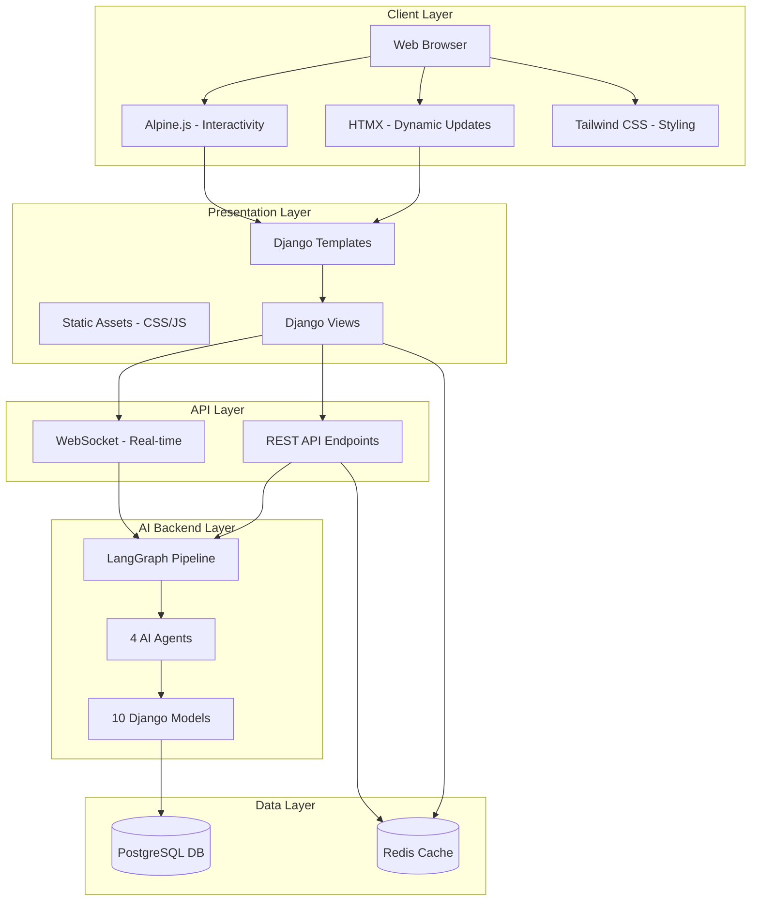
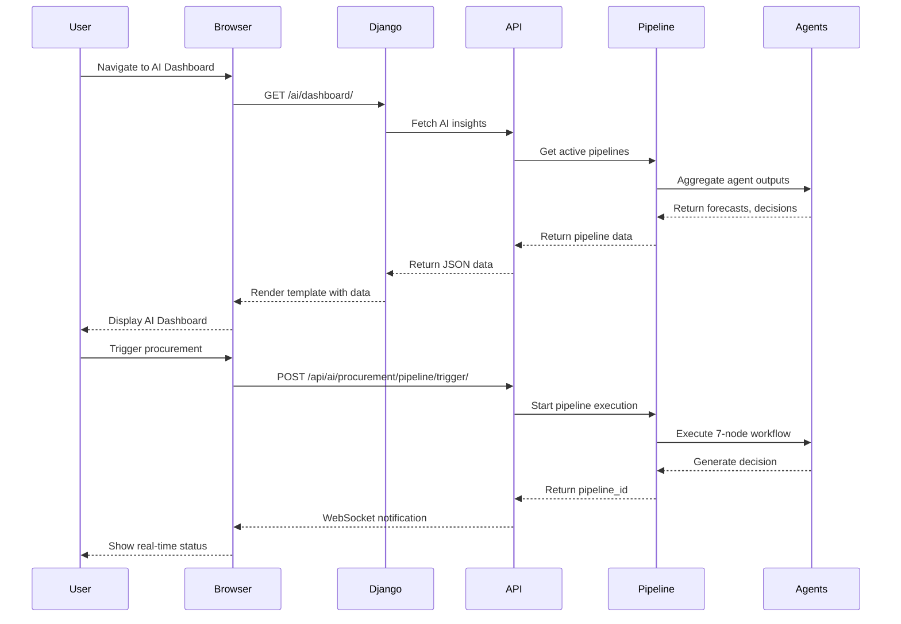
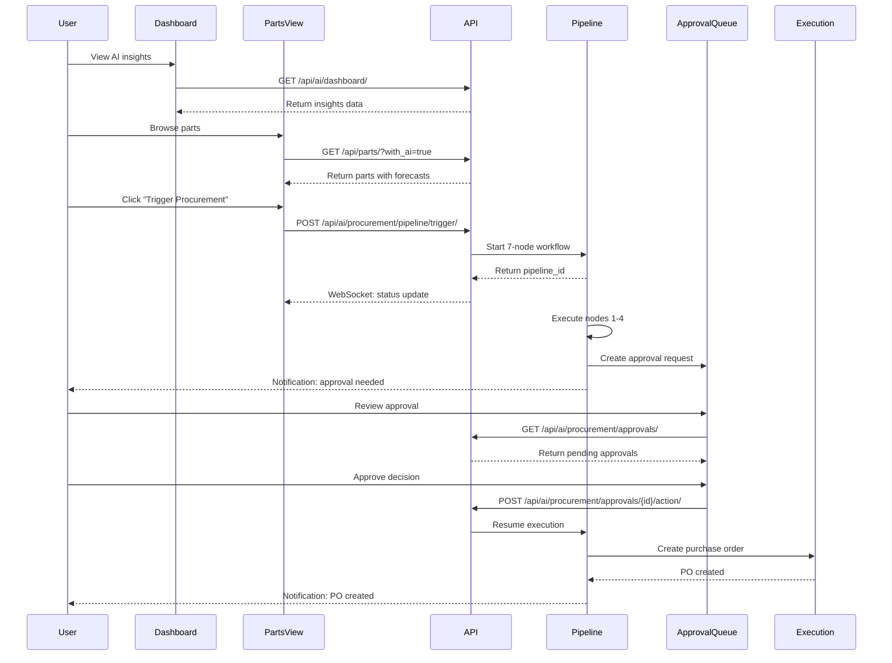

# Design Document: AI-First Logistics Management System Web Interface

## Overview

This design document outlines a comprehensive web interface for an AI-First Logistics Management System that transforms InvenTree's complex React frontend into a simpler, more intuitive HTML/CSS/JavaScript interface. The system leverages an existing Django backend with a complete AI Procurement pipeline (10 models, 7-node LangGraph workflow, 4 specialized agents) and positions AI as the central intelligence layer rather than a peripheral plugin.

The interface prioritizes simplicity, usability, and AI-first interactions using modern lightweight frameworks (HTMX, Alpine.js) for interactivity and Tailwind CSS for styling. Django templates provide server-side rendering with RESTful API integration for real-time updates. The design emphasizes fast page loads, responsive layouts, and minimal JavaScript complexity while maintaining powerful AI-driven features including demand forecasting, supplier evaluation, procurement decisions, and human-in-the-loop approval workflows.

## Architecture



### System Flow



## Components and Interfaces

### Component 1: AI Dashboard

**Purpose**: Central hub displaying AI insights, predictions, recommendations, and system health

**Interface**:
```javascript
// Dashboard API Interface
interface DashboardData {
  insights: {
    activePipelines: number;
    pendingApprovals: number;
    recentDecisions: number;
    forecastAccuracy: number;
  };
  predictions: Array<{
    partId: number;
    partName: string;
    predictedDemand: number;
    confidence: string;
    trendDirection: string;
  }>;
  recommendations: Array<{
    type: string;
    priority: string;
    message: string;
    actionUrl: string;
  }>;
  recentActivity: Array<{
    timestamp: string;
    type: string;
    description: string;
    status: string;
  }>;
}
```

**Responsibilities**:
- Display real-time AI system metrics and KPIs
- Show demand forecasts and trend predictions
- Present actionable recommendations prioritized by AI
- Track recent pipeline executions and outcomes
- Provide quick navigation to approval queue and parts management


### Component 2: Parts Management with AI

**Purpose**: Parts catalog with integrated AI-driven demand forecasting and reorder recommendations

**Interface**:
```javascript
// Parts API Interface
interface PartData {
  id: number;
  name: string;
  description: string;
  category: string;
  currentStock: number;
  minimumStock: number;
  reorderPoint: number;
  aiInsights: {
    forecastedDemand: number;
    confidenceInterval: [number, number];
    trendDirection: string;
    recommendReorder: boolean;
    daysUntilStockout: number;
  };
  suppliers: Array<{
    id: number;
    name: string;
    unitPrice: number;
    leadTimeDays: number;
    reliabilityScore: number;
  }>;
}
```

**Responsibilities**:
- Display parts catalog with search and filtering
- Show AI-generated demand forecasts per part
- Highlight parts requiring reorder based on AI analysis
- Provide one-click procurement trigger
- Display supplier rankings with AI scores


### Component 3: Procurement Pipeline Viewer

**Purpose**: Real-time visualization of AI procurement pipeline execution

**Interface**:
```javascript
// Pipeline API Interface
interface PipelineStatus {
  pipelineId: string;
  partId: number;
  partName: string;
  status: 'running' | 'interrupted' | 'completed' | 'failed' | 'rejected';
  currentNode: string;
  triggerReason: string;
  createdAt: string;
  updatedAt: string;
  completedAt: string | null;
  errorMessage: string | null;
  nodeProgress: Array<{
    nodeName: string;
    status: 'pending' | 'running' | 'completed' | 'failed';
    output: any;
  }>;
}
```

**Responsibilities**:
- Display pipeline execution progress through 7 nodes
- Show real-time status updates via WebSocket
- Visualize agent outputs at each node
- Provide error details and retry options
- Link to approval requests when pipeline interrupts


### Component 4: Approval Queue (HITL Interface)

**Purpose**: Human-in-the-loop approval interface for AI procurement decisions

**Interface**:
```javascript
// Approval API Interface
interface ApprovalRequest {
  requestId: string;
  pipelineId: string;
  partId: number;
  partName: string;
  status: 'pending' | 'approved' | 'rejected' | 'modified' | 'expired';
  decision: {
    decision: string;
    recommendedQuantity: number;
    recommendedSupplierId: number;
    reasoning: string;
    confidenceLevel: string;
    riskFactors: Array<string>;
  };
  forecast: {
    predictedDemand: number;
    confidenceLower: number;
    confidenceUpper: number;
    trendDirection: string;
  };
  suppliers: Array<{
    id: number;
    name: string;
    overallScore: number;
    unitPrice: number;
    totalCost: number;
    estimatedDeliveryDays: number;
    rankingPosition: number;
  }>;
  createdAt: string;
  expiresAt: string;
}
```

**Responsibilities**:
- Display pending approval requests in priority order
- Show AI decision reasoning and confidence levels
- Present forecast data and supplier rankings
- Allow approve/reject/modify actions
- Support bulk approval operations
- Send notifications for new approvals


### Component 5: Supplier Management with AI Scoring

**Purpose**: Supplier catalog with AI-powered evaluation and reliability tracking

**Interface**:
```javascript
// Supplier API Interface
interface SupplierData {
  id: number;
  name: string;
  description: string;
  active: boolean;
  reliabilityMetrics: {
    onTimeDeliveryRate: number;
    qualityAcceptanceRate: number;
    leadTimeAccuracy: number;
    totalOrders: number;
    successfulOrders: number;
  };
  aiScore: {
    overallScore: number;
    priceScore: number;
    leadTimeScore: number;
    reliabilityScore: number;
  };
  parts: Array<{
    partId: number;
    partName: string;
    unitPrice: number;
    moq: number;
    leadTimeDays: number;
  }>;
}
```

**Responsibilities**:
- Display supplier catalog with AI reliability scores
- Show historical performance metrics
- Rank suppliers by AI evaluation criteria
- Provide supplier comparison tools
- Track supplier reliability over time


### Component 6: Analytics Dashboard

**Purpose**: AI predictions, trends, performance metrics, and learning insights

**Interface**:
```javascript
// Analytics API Interface
interface AnalyticsData {
  forecastAccuracy: {
    overall: number;
    byCategory: Array<{
      categoryName: string;
      accuracy: number;
    }>;
    trend: Array<{
      date: string;
      accuracy: number;
    }>;
  };
  procurementMetrics: {
    totalPipelines: number;
    successRate: number;
    averageExecutionTime: number;
    costSavings: number;
  };
  supplierPerformance: Array<{
    supplierId: number;
    supplierName: string;
    onTimeRate: number;
    qualityRate: number;
    totalOrders: number;
  }>;
  demandTrends: Array<{
    partId: number;
    partName: string;
    historicalDemand: Array<{date: string; quantity: number}>;
    forecastedDemand: Array<{date: string; quantity: number}>;
  }>;
}
```

**Responsibilities**:
- Visualize forecast accuracy and model performance
- Display procurement pipeline success metrics
- Show supplier performance trends
- Present demand forecasting charts
- Track AI learning improvements over time


### Component 7: Inventory Management with AI Optimization

**Purpose**: Inventory tracking with AI-optimized stock levels and alerts

**Interface**:
```javascript
// Inventory API Interface
interface InventoryData {
  partId: number;
  partName: string;
  locations: Array<{
    locationId: number;
    locationName: string;
    quantity: number;
  }>;
  totalStock: number;
  minimumStock: number;
  reorderPoint: number;
  aiOptimization: {
    recommendedReorderPoint: number;
    recommendedMinimumStock: number;
    adjustmentReason: string;
    forecastAccuracy: number;
    stockoutRisk: string;
  };
  alerts: Array<{
    type: string;
    severity: string;
    message: string;
  }>;
}
```

**Responsibilities**:
- Display current inventory levels across locations
- Show AI-optimized reorder points
- Generate alerts for low stock and stockout risks
- Recommend inventory adjustments based on forecasts
- Track inventory turnover and efficiency


## Data Models

### Model 1: Dashboard State

```javascript
interface DashboardState {
  userId: number;
  preferences: {
    defaultView: string;
    refreshInterval: number;
    notificationsEnabled: boolean;
  };
  widgets: Array<{
    widgetId: string;
    position: number;
    visible: boolean;
    config: object;
  }>;
}
```

**Validation Rules**:
- userId must be valid authenticated user
- refreshInterval must be between 5 and 300 seconds
- widgetId must match available widget types

### Model 2: Pipeline Execution State

```javascript
interface PipelineExecutionState {
  pipelineId: string;
  partId: number;
  status: string;
  currentNode: string;
  stateData: {
    dataCollection: object;
    forecast: object;
    suppliers: Array<object>;
    decision: object;
    approvalRequestId: string;
    poId: number;
  };
  triggerReason: string;
  createdAt: string;
  updatedAt: string;
  completedAt: string | null;
  errorMessage: string | null;
}
```

**Validation Rules**:
- pipelineId must be valid UUID
- status must be one of: running, interrupted, completed, failed, rejected
- currentNode must match valid node names in workflow
- stateData must contain valid JSON structure


### Model 3: Approval Request State

```javascript
interface ApprovalRequestState {
  requestId: string;
  pipelineId: string;
  partId: number;
  decisionLogId: string;
  status: string;
  createdAt: string;
  expiresAt: string;
  respondedAt: string | null;
  respondedBy: number | null;
  action: string | null;
  modifiedQuantity: number | null;
  modifiedSupplierId: number | null;
  userNotes: string;
}
```

**Validation Rules**:
- requestId must be valid UUID
- status must be one of: pending, approved, rejected, modified, expired
- action must be one of: approve, reject, modify (if provided)
- expiresAt must be future timestamp
- modifiedQuantity must be positive number if action is modify

## Main Algorithm/Workflow



## Key Functions with Formal Specifications

### Function 1: triggerProcurement()

```javascript
function triggerProcurement(partId) {
  // Trigger AI procurement pipeline for a part
  // Returns: Promise<{pipelineId: string, status: string}>
}
```

**Preconditions:**
- `partId` is a valid integer representing an existing part
- User has permission to trigger procurement
- Part has at least one linked supplier

**Postconditions:**
- Returns valid pipeline_id (UUID format)
- Pipeline status is 'running'
- PipelineExecution record created in database
- WebSocket connection established for real-time updates
- No side effects on part or supplier data

**Loop Invariants:** N/A (no loops in function)

### Function 2: processApproval()

```javascript
function processApproval(requestId, action, userData) {
  // Process human approval action
  // Returns: Promise<{message: string, pipelineId: string, status: string}>
}
```

**Preconditions:**
- `requestId` is valid UUID for existing approval request
- `action` is one of: 'approve', 'reject', 'modify'
- If action is 'modify', userData contains valid modifiedQuantity or modifiedSupplierId
- User has permission to approve purchase orders
- Approval request status is 'pending'

**Postconditions:**
- Approval request status updated to match action
- If approved: pipeline resumes execution from execution node
- If rejected: pipeline status set to 'rejected'
- If modified: pipeline uses modified values for PO creation
- respondedAt timestamp set to current time
- respondedBy set to current user ID

**Loop Invariants:** N/A (no loops in function)


### Function 3: fetchDashboardData()

```javascript
function fetchDashboardData() {
  // Fetch AI dashboard insights and metrics
  // Returns: Promise<DashboardData>
}
```

**Preconditions:**
- User is authenticated
- User has permission to view dashboard

**Postconditions:**
- Returns valid DashboardData object
- All numeric metrics are non-negative
- activePipelines count matches database query
- pendingApprovals count matches non-expired pending requests
- forecastAccuracy is between 0 and 1
- No mutations to database state

**Loop Invariants:**
- For aggregation loops: All processed records contribute to correct totals
- All timestamps are valid and properly formatted

### Function 4: updatePipelineStatus()

```javascript
function updatePipelineStatus(pipelineId, statusUpdate) {
  // Update pipeline execution status via WebSocket
  // Returns: void
}
```

**Preconditions:**
- `pipelineId` is valid UUID
- WebSocket connection is established
- `statusUpdate` contains valid status and currentNode

**Postconditions:**
- PipelineExecution record updated in database
- WebSocket message broadcast to subscribed clients
- updatedAt timestamp set to current time
- If status is 'completed' or 'failed', completedAt timestamp set
- UI reflects updated status without page refresh

**Loop Invariants:** N/A (no loops in function)


## Algorithmic Pseudocode

### Main Dashboard Rendering Algorithm

```javascript
// Algorithm: Render AI Dashboard
// Input: userId (authenticated user ID)
// Output: Rendered dashboard HTML with AI insights

async function renderDashboard(userId) {
  // Precondition: userId is valid and authenticated
  
  // Step 1: Fetch dashboard data from API
  const dashboardData = await fetch('/api/ai/dashboard/')
    .then(response => response.json());
  
  // Step 2: Fetch active pipelines
  const activePipelines = await fetch('/api/ai/procurement/pipeline/status/')
    .then(response => response.json());
  
  // Step 3: Fetch pending approvals
  const pendingApprovals = await fetch('/api/ai/procurement/approvals/?status=pending')
    .then(response => response.json());
  
  // Step 4: Aggregate insights
  const insights = {
    activePipelines: activePipelines.pipelines.length,
    pendingApprovals: pendingApprovals.approvals.length,
    recentDecisions: dashboardData.recentDecisions,
    forecastAccuracy: dashboardData.forecastAccuracy
  };
  
  // Step 5: Render template with data
  const template = document.getElementById('dashboard-template');
  const rendered = template.content.cloneNode(true);
  
  // Step 6: Populate template with insights
  rendered.querySelector('[data-active-pipelines]').textContent = insights.activePipelines;
  rendered.querySelector('[data-pending-approvals]').textContent = insights.pendingApprovals;
  rendered.querySelector('[data-forecast-accuracy]').textContent = 
    (insights.forecastAccuracy * 100).toFixed(1) + '%';
  
  // Step 7: Attach to DOM
  document.getElementById('dashboard-container').appendChild(rendered);
  
  // Step 8: Initialize WebSocket for real-time updates
  initializeWebSocket(userId);
  
  // Postcondition: Dashboard rendered with current AI insights
}
```

**Preconditions:**
- userId is valid authenticated user
- API endpoints are accessible
- Dashboard template exists in DOM

**Postconditions:**
- Dashboard rendered with current data
- WebSocket connection established
- All metrics displayed are accurate
- UI is interactive and responsive

**Loop Invariants:** N/A (async operations, no explicit loops)


### Procurement Trigger Algorithm

```javascript
// Algorithm: Trigger AI Procurement Pipeline
// Input: partId (part to procure)
// Output: pipelineId (UUID of started pipeline)

async function triggerProcurement(partId) {
  // Precondition: partId is valid, user has permission
  
  // Step 1: Validate part exists
  const part = await fetch(`/api/parts/${partId}/`)
    .then(response => {
      if (!response.ok) throw new Error('Part not found');
      return response.json();
    });
  
  // Step 2: Check if part has suppliers
  if (!part.suppliers || part.suppliers.length === 0) {
    throw new Error('Part has no linked suppliers');
  }
  
  // Step 3: Trigger pipeline via API
  const response = await fetch('/api/ai/procurement/pipeline/trigger/', {
    method: 'POST',
    headers: {'Content-Type': 'application/json'},
    body: JSON.stringify({part_id: partId})
  });
  
  // Step 4: Handle response
  if (!response.ok) {
    const error = await response.json();
    throw new Error(error.error || 'Failed to start pipeline');
  }
  
  const result = await response.json();
  const pipelineId = result.pipeline_id;
  
  // Step 5: Subscribe to pipeline updates via WebSocket
  subscribeToWebSocket(pipelineId);
  
  // Step 6: Show success notification
  showNotification('success', `Procurement pipeline started for ${part.name}`);
  
  // Step 7: Redirect to pipeline status page
  window.location.href = `/ai/procurement/pipeline/${pipelineId}/`;
  
  // Postcondition: Pipeline started, user redirected to status page
  return pipelineId;
}
```

**Preconditions:**
- partId is valid integer
- Part exists in database
- Part has at least one supplier
- User has procurement trigger permission

**Postconditions:**
- Pipeline execution started
- PipelineExecution record created
- User redirected to pipeline status page
- WebSocket subscription established
- Success notification displayed

**Loop Invariants:** N/A (no loops in function)


### Approval Processing Algorithm

```javascript
// Algorithm: Process Approval Request
// Input: requestId (approval request UUID), action (approve/reject/modify), userData (optional modifications)
// Output: Updated pipeline status

async function processApproval(requestId, action, userData = {}) {
  // Precondition: requestId is valid, action is valid, user has permission
  
  // Step 1: Validate action
  const validActions = ['approve', 'reject', 'modify'];
  if (!validActions.includes(action)) {
    throw new Error('Invalid action. Must be approve, reject, or modify');
  }
  
  // Step 2: If modifying, validate modification data
  if (action === 'modify') {
    if (!userData.modified_quantity && !userData.modified_supplier_id) {
      throw new Error('Modify action requires modified_quantity or modified_supplier_id');
    }
    if (userData.modified_quantity && userData.modified_quantity <= 0) {
      throw new Error('Modified quantity must be positive');
    }
  }
  
  // Step 3: Submit approval action to API
  const response = await fetch(`/api/ai/procurement/approvals/${requestId}/action/`, {
    method: 'POST',
    headers: {'Content-Type': 'application/json'},
    body: JSON.stringify({
      action: action,
      modified_quantity: userData.modified_quantity,
      modified_supplier_id: userData.modified_supplier_id,
      user_notes: userData.user_notes || ''
    })
  });
  
  // Step 4: Handle response
  if (!response.ok) {
    const error = await response.json();
    throw new Error(error.error || 'Failed to process approval');
  }
  
  const result = await response.json();
  
  // Step 5: Show success notification
  const actionText = action === 'approve' ? 'approved' : 
                     action === 'reject' ? 'rejected' : 'modified';
  showNotification('success', `Procurement decision ${actionText}`);
  
  // Step 6: Update UI to reflect approval status
  updateApprovalCardStatus(requestId, action);
  
  // Step 7: If approved, redirect to pipeline status
  if (action === 'approve' || action === 'modify') {
    setTimeout(() => {
      window.location.href = `/ai/procurement/pipeline/${result.pipeline_id}/`;
    }, 1000);
  }
  
  // Postcondition: Approval processed, pipeline resumed or rejected
  return result;
}
```

**Preconditions:**
- requestId is valid UUID for existing approval request
- action is one of: approve, reject, modify
- If action is modify, userData contains valid modifications
- User has approval permission
- Approval request status is pending

**Postconditions:**
- Approval request status updated
- If approved/modified: pipeline resumes execution
- If rejected: pipeline status set to rejected
- UI updated to reflect new status
- User notified of action result

**Loop Invariants:** N/A (no loops in function)


### WebSocket Real-Time Update Algorithm

```javascript
// Algorithm: Handle WebSocket Real-Time Updates
// Input: WebSocket connection, message handlers
// Output: Real-time UI updates

function initializeWebSocket(userId) {
  // Precondition: userId is authenticated
  
  // Step 1: Establish WebSocket connection
  const wsProtocol = window.location.protocol === 'https:' ? 'wss:' : 'ws:';
  const wsUrl = `${wsProtocol}//${window.location.host}/ws/ai/procurement/`;
  const socket = new WebSocket(wsUrl);
  
  // Step 2: Handle connection open
  socket.onopen = function(event) {
    console.log('WebSocket connected');
    
    // Subscribe to user-specific updates
    socket.send(JSON.stringify({
      type: 'subscribe',
      user_id: userId
    }));
  };
  
  // Step 3: Handle incoming messages
  socket.onmessage = function(event) {
    const message = JSON.parse(event.data);
    
    // Route message to appropriate handler
    switch (message.type) {
      case 'pipeline_status':
        handlePipelineStatusUpdate(message.data);
        break;
      case 'approval_request':
        handleNewApprovalRequest(message.data);
        break;
      case 'approval_response':
        handleApprovalResponse(message.data);
        break;
      case 'notification':
        showNotification(message.severity, message.message);
        break;
      default:
        console.warn('Unknown message type:', message.type);
    }
  };
  
  // Step 4: Handle connection errors
  socket.onerror = function(error) {
    console.error('WebSocket error:', error);
    showNotification('error', 'Real-time connection error. Refreshing page...');
    setTimeout(() => window.location.reload(), 3000);
  };
  
  // Step 5: Handle connection close
  socket.onclose = function(event) {
    console.log('WebSocket closed');
    
    // Attempt reconnection after 5 seconds
    setTimeout(() => {
      console.log('Attempting WebSocket reconnection...');
      initializeWebSocket(userId);
    }, 5000);
  };
  
  // Postcondition: WebSocket connection established with message handlers
  return socket;
}
```

**Preconditions:**
- userId is valid authenticated user
- WebSocket endpoint is accessible
- Browser supports WebSocket API

**Postconditions:**
- WebSocket connection established
- Message handlers registered for all message types
- Automatic reconnection on disconnect
- UI updates in real-time without page refresh

**Loop Invariants:**
- Connection remains active throughout session
- All messages are properly routed to handlers
- Reconnection attempts maintain connection integrity


## Example Usage

### Example 1: Dashboard Page Load

```html
<!-- Dashboard Template -->
<div id="dashboard-container" class="container mx-auto p-6">
  <template id="dashboard-template">
    <div class="grid grid-cols-1 md:grid-cols-4 gap-6">
      <!-- AI Insights Cards -->
      <div class="bg-white rounded-lg shadow p-6">
        <h3 class="text-gray-500 text-sm">Active Pipelines</h3>
        <p class="text-3xl font-bold" data-active-pipelines>0</p>
      </div>
      
      <div class="bg-white rounded-lg shadow p-6">
        <h3 class="text-gray-500 text-sm">Pending Approvals</h3>
        <p class="text-3xl font-bold text-orange-600" data-pending-approvals>0</p>
      </div>
      
      <div class="bg-white rounded-lg shadow p-6">
        <h3 class="text-gray-500 text-sm">Forecast Accuracy</h3>
        <p class="text-3xl font-bold text-green-600" data-forecast-accuracy>0%</p>
      </div>
      
      <div class="bg-white rounded-lg shadow p-6">
        <h3 class="text-gray-500 text-sm">Recent Decisions</h3>
        <p class="text-3xl font-bold" data-recent-decisions>0</p>
      </div>
    </div>
  </template>
</div>

<script>
  // Initialize dashboard on page load
  document.addEventListener('DOMContentLoaded', async () => {
    const userId = document.body.dataset.userId;
    await renderDashboard(userId);
  });
</script>
```


### Example 2: Trigger Procurement with HTMX

```html
<!-- Parts List with AI Insights -->
<div class="parts-list">
  <div class="part-card bg-white rounded-lg shadow p-4" data-part-id="123">
    <h3 class="font-bold">Resistor 10K Ohm</h3>
    <div class="flex justify-between mt-2">
      <span class="text-sm text-gray-600">Stock: 50 units</span>
      <span class="text-sm text-red-600">Reorder Point: 100</span>
    </div>
    
    <!-- AI Insights -->
    <div class="mt-3 p-3 bg-blue-50 rounded">
      <p class="text-sm font-semibold text-blue-800">AI Recommendation</p>
      <p class="text-xs text-blue-600">Forecasted demand: 150 units (30 days)</p>
      <p class="text-xs text-blue-600">Stockout risk: High</p>
    </div>
    
    <!-- Trigger Procurement Button with HTMX -->
    <button 
      class="mt-4 w-full bg-blue-600 text-white py-2 rounded hover:bg-blue-700"
      hx-post="/api/ai/procurement/pipeline/trigger/"
      hx-vals='{"part_id": 123}'
      hx-swap="outerHTML"
      hx-target="#pipeline-status"
      onclick="triggerProcurement(123)">
      Trigger AI Procurement
    </button>
  </div>
</div>

<div id="pipeline-status"></div>

<script>
  async function triggerProcurement(partId) {
    try {
      const pipelineId = await triggerProcurement(partId);
      console.log('Pipeline started:', pipelineId);
    } catch (error) {
      showNotification('error', error.message);
    }
  }
</script>
```


### Example 3: Approval Queue with Alpine.js

```html
<!-- Approval Queue -->
<div x-data="approvalQueue()" x-init="loadApprovals()" class="container mx-auto p-6">
  <h1 class="text-2xl font-bold mb-6">Approval Queue</h1>
  
  <!-- Pending Approvals List -->
  <template x-for="approval in approvals" :key="approval.request_id">
    <div class="bg-white rounded-lg shadow p-6 mb-4">
      <div class="flex justify-between items-start">
        <div>
          <h3 class="text-lg font-bold" x-text="approval.part_name"></h3>
          <p class="text-sm text-gray-600">Pipeline ID: <span x-text="approval.pipeline_id"></span></p>
        </div>
        <span class="px-3 py-1 bg-orange-100 text-orange-800 rounded-full text-sm">
          Pending
        </span>
      </div>
      
      <!-- AI Decision -->
      <div class="mt-4 p-4 bg-gray-50 rounded">
        <p class="font-semibold">AI Decision: <span x-text="approval.decision.decision"></span></p>
        <p class="text-sm mt-2">Quantity: <span x-text="approval.decision.recommended_quantity"></span> units</p>
        <p class="text-sm">Confidence: <span x-text="approval.decision.confidence_level"></span></p>
        <p class="text-sm mt-2 text-gray-700" x-text="approval.decision.reasoning"></p>
      </div>
      
      <!-- Forecast Data -->
      <div class="mt-3 grid grid-cols-3 gap-4">
        <div>
          <p class="text-xs text-gray-500">Predicted Demand</p>
          <p class="font-bold" x-text="approval.forecast.predicted_demand"></p>
        </div>
        <div>
          <p class="text-xs text-gray-500">Confidence Range</p>
          <p class="font-bold" x-text="`${approval.forecast.confidence_lower} - ${approval.forecast.confidence_upper}`"></p>
        </div>
        <div>
          <p class="text-xs text-gray-500">Trend</p>
          <p class="font-bold" x-text="approval.forecast.trend_direction"></p>
        </div>
      </div>
      
      <!-- Action Buttons -->
      <div class="mt-6 flex gap-3">
        <button 
          @click="approve(approval.request_id)"
          class="px-6 py-2 bg-green-600 text-white rounded hover:bg-green-700">
          Approve
        </button>
        <button 
          @click="reject(approval.request_id)"
          class="px-6 py-2 bg-red-600 text-white rounded hover:bg-red-700">
          Reject
        </button>
        <button 
          @click="openModifyModal(approval)"
          class="px-6 py-2 bg-blue-600 text-white rounded hover:bg-blue-700">
          Modify
        </button>
      </div>
    </div>
  </template>
</div>

<script>
  function approvalQueue() {
    return {
      approvals: [],
      
      async loadApprovals() {
        const response = await fetch('/api/ai/procurement/approvals/?status=pending');
        const data = await response.json();
        this.approvals = data.approvals;
      },
      
      async approve(requestId) {
        await processApproval(requestId, 'approve');
        await this.loadApprovals();
      },
      
      async reject(requestId) {
        await processApproval(requestId, 'reject');
        await this.loadApprovals();
      },
      
      openModifyModal(approval) {
        // Open modal for modification
        Alpine.store('modal').open('modify-approval', approval);
      }
    };
  }
</script>
```


### Example 4: Pipeline Status with Real-Time Updates

```html
<!-- Pipeline Status Page -->
<div class="container mx-auto p-6">
  <h1 class="text-2xl font-bold mb-6">Pipeline Execution Status</h1>
  
  <div id="pipeline-status" class="bg-white rounded-lg shadow p-6">
    <!-- Pipeline Header -->
    <div class="flex justify-between items-center mb-6">
      <div>
        <h2 class="text-xl font-bold" id="part-name">Loading...</h2>
        <p class="text-sm text-gray-600">Pipeline ID: <span id="pipeline-id"></span></p>
      </div>
      <span id="status-badge" class="px-4 py-2 rounded-full text-sm font-semibold">
        Running
      </span>
    </div>
    
    <!-- Progress Visualization -->
    <div class="mb-8">
      <div class="flex justify-between items-center">
        <div class="node-step" data-node="data_collection">
          <div class="w-12 h-12 rounded-full bg-green-500 flex items-center justify-center text-white">
            ✓
          </div>
          <p class="text-xs mt-2 text-center">Data Collection</p>
        </div>
        
        <div class="flex-1 h-1 bg-green-500 mx-2"></div>
        
        <div class="node-step" data-node="demand_forecasting">
          <div class="w-12 h-12 rounded-full bg-green-500 flex items-center justify-center text-white">
            ✓
          </div>
          <p class="text-xs mt-2 text-center">Forecasting</p>
        </div>
        
        <div class="flex-1 h-1 bg-green-500 mx-2"></div>
        
        <div class="node-step" data-node="supplier_ranking">
          <div class="w-12 h-12 rounded-full bg-blue-500 flex items-center justify-center text-white">
            ⟳
          </div>
          <p class="text-xs mt-2 text-center">Supplier Ranking</p>
        </div>
        
        <div class="flex-1 h-1 bg-gray-300 mx-2"></div>
        
        <div class="node-step" data-node="decision_making">
          <div class="w-12 h-12 rounded-full bg-gray-300 flex items-center justify-center text-gray-500">
            4
          </div>
          <p class="text-xs mt-2 text-center">Decision Making</p>
        </div>
        
        <!-- Additional nodes... -->
      </div>
    </div>
    
    <!-- Node Outputs -->
    <div id="node-outputs" class="space-y-4">
      <!-- Dynamically populated by WebSocket updates -->
    </div>
  </div>
</div>

<script>
  // Initialize pipeline status page
  document.addEventListener('DOMContentLoaded', () => {
    const pipelineId = window.location.pathname.split('/').pop();
    
    // Load initial status
    loadPipelineStatus(pipelineId);
    
    // Subscribe to real-time updates
    const socket = initializeWebSocket(document.body.dataset.userId);
    
    // Handle pipeline status updates
    window.handlePipelineStatusUpdate = function(data) {
      if (data.pipeline_id === pipelineId) {
        updatePipelineUI(data);
      }
    };
  });
  
  async function loadPipelineStatus(pipelineId) {
    const response = await fetch(`/api/ai/procurement/pipeline/status/${pipelineId}/`);
    const data = await response.json();
    updatePipelineUI(data);
  }
  
  function updatePipelineUI(data) {
    // Update header
    document.getElementById('pipeline-id').textContent = data.pipeline_id;
    document.getElementById('part-name').textContent = data.part_name;
    
    // Update status badge
    const badge = document.getElementById('status-badge');
    badge.textContent = data.status;
    badge.className = `px-4 py-2 rounded-full text-sm font-semibold ${getStatusColor(data.status)}`;
    
    // Update node progress
    updateNodeProgress(data.current_node, data.status);
    
    // Update node outputs
    if (data.node_progress) {
      renderNodeOutputs(data.node_progress);
    }
  }
  
  function getStatusColor(status) {
    const colors = {
      'running': 'bg-blue-100 text-blue-800',
      'interrupted': 'bg-orange-100 text-orange-800',
      'completed': 'bg-green-100 text-green-800',
      'failed': 'bg-red-100 text-red-800',
      'rejected': 'bg-gray-100 text-gray-800'
    };
    return colors[status] || 'bg-gray-100 text-gray-800';
  }
</script>
```


## Correctness Properties

### Property 1: Pipeline Execution Integrity

**Universal Quantification:**
```
∀ pipeline ∈ PipelineExecutions:
  (pipeline.status = 'completed') ⟹ 
    (∃ po ∈ PurchaseOrders: po.pipeline_id = pipeline.id) ∨
    (pipeline.status = 'rejected')
```

**Meaning:** For all completed pipelines, either a purchase order was created OR the pipeline was explicitly rejected by a human. No pipeline completes without a concrete outcome.

### Property 2: Approval Request Validity

**Universal Quantification:**
```
∀ approval ∈ ApprovalRequests:
  (approval.status = 'pending') ⟹ 
    (approval.expires_at > current_time) ∧
    (∃ pipeline ∈ PipelineExecutions: 
      pipeline.id = approval.pipeline_id ∧ 
      pipeline.status = 'interrupted')
```

**Meaning:** All pending approval requests must not be expired AND must have a corresponding interrupted pipeline. This ensures approval requests are always valid and actionable.

### Property 3: Forecast Confidence Bounds

**Universal Quantification:**
```
∀ forecast ∈ DemandForecasts:
  (forecast.confidence_lower ≤ forecast.predicted_demand) ∧
  (forecast.predicted_demand ≤ forecast.confidence_upper) ∧
  (forecast.confidence_lower ≥ 0) ∧
  (forecast.confidence_upper ≥ 0)
```

**Meaning:** All demand forecasts must have valid confidence intervals where the predicted demand falls within the bounds, and all values are non-negative.

### Property 4: Supplier Ranking Consistency

**Universal Quantification:**
```
∀ pipeline ∈ PipelineExecutions:
  ∀ eval1, eval2 ∈ SupplierEvaluations:
    (eval1.pipeline_id = pipeline.id ∧ eval2.pipeline_id = pipeline.id) ⟹
      (eval1.ranking_position ≠ eval2.ranking_position) ∨ (eval1.id = eval2.id)
```

**Meaning:** Within a single pipeline execution, no two different supplier evaluations can have the same ranking position. Rankings must be unique and consistent.

### Property 5: Real-Time Update Consistency

**Universal Quantification:**
```
∀ pipeline ∈ PipelineExecutions:
  (pipeline.updated_at > pipeline.created_at) ∧
  ((pipeline.status = 'completed' ∨ pipeline.status = 'failed') ⟹ 
    (pipeline.completed_at ≠ null ∧ pipeline.completed_at ≥ pipeline.updated_at))
```

**Meaning:** All pipelines must have valid timestamps where updates occur after creation, and completed/failed pipelines must have a completion timestamp that is at or after the last update.

### Property 6: Human Approval Authority

**Universal Quantification:**
```
∀ approval ∈ ApprovalRequests:
  (approval.status ≠ 'pending') ⟹
    (approval.responded_by ≠ null ∧ 
     approval.responded_at ≠ null ∧
     approval.action ∈ {'approve', 'reject', 'modify'})
```

**Meaning:** All non-pending approval requests must have been responded to by a specific user at a specific time with a valid action. No approvals can be processed without human authority.

### Property 7: Data Integrity Across Layers

**Universal Quantification:**
```
∀ pipeline ∈ PipelineExecutions:
  (pipeline.status = 'completed') ⟹
    (∃ forecast ∈ DemandForecasts: forecast.pipeline_id = pipeline.id) ∧
    (∃ decision ∈ ProcurementDecisionLogs: decision.pipeline_id = pipeline.id) ∧
    (∃ outcome ∈ ProcurementOutcomes: outcome.pipeline_id = pipeline.id)
```

**Meaning:** All completed pipelines must have corresponding records in forecast, decision, and outcome tables. This ensures complete data lineage and traceability.


## Error Handling

### Error Scenario 1: API Request Failure

**Condition:** API endpoint returns 4xx or 5xx status code
**Response:** 
- Display user-friendly error message in notification toast
- Log detailed error to browser console
- Retry request up to 3 times with exponential backoff
- If all retries fail, show "Try again" button
**Recovery:**
- User can manually retry the operation
- System maintains UI state during retry
- No data loss or corruption

### Error Scenario 2: WebSocket Connection Lost

**Condition:** WebSocket connection drops or fails to establish
**Response:**
- Display warning notification: "Real-time updates paused"
- Attempt automatic reconnection every 5 seconds
- Fall back to polling API every 10 seconds for critical updates
- Log connection attempts
**Recovery:**
- Automatic reconnection when network restored
- Sync missed updates from API on reconnection
- Resume normal WebSocket operation

### Error Scenario 3: Pipeline Execution Failure

**Condition:** Pipeline node throws exception or times out
**Response:**
- Update pipeline status to 'failed'
- Store error message in pipeline.error_message field
- Send notification to user who triggered pipeline
- Display error details in pipeline status page
**Recovery:**
- User can view error details and logs
- User can retry pipeline from beginning
- System preserves failed pipeline data for debugging

### Error Scenario 4: Approval Request Expiration

**Condition:** Approval request expires before human response
**Response:**
- Update approval status to 'expired'
- Update pipeline status to 'interrupted' (remains interrupted)
- Send notification to relevant users
- Display expired status in approval queue
**Recovery:**
- User can create new approval request
- User can manually trigger new pipeline execution
- Original pipeline data preserved for audit

### Error Scenario 5: Invalid User Input

**Condition:** User submits invalid data (e.g., negative quantity, invalid supplier)
**Response:**
- Validate input on client-side before API call
- Display inline validation errors
- Prevent form submission until valid
- If server-side validation fails, display error message
**Recovery:**
- User corrects input based on validation feedback
- Form retains valid fields
- No partial data submitted to server

### Error Scenario 6: Permission Denied

**Condition:** User attempts action without required permission
**Response:**
- Return 403 Forbidden from API
- Display error message: "You don't have permission to perform this action"
- Hide or disable UI elements for unauthorized actions
- Log permission denial for security audit
**Recovery:**
- User contacts administrator for permission
- UI reflects user's actual permissions
- No security breach or data exposure


## Testing Strategy

### Unit Testing Approach

**Frontend JavaScript Functions:**
- Test all API interaction functions (triggerProcurement, processApproval, fetchDashboardData)
- Test WebSocket message handlers
- Test UI update functions
- Test validation logic
- Use Jest or Mocha for JavaScript unit tests
- Mock API responses and WebSocket connections
- Aim for 80%+ code coverage

**Django Views:**
- Test all view functions with various input scenarios
- Test permission checks
- Test error handling paths
- Use Django TestCase and APITestCase
- Mock external dependencies (LangGraph, agents)
- Test both success and failure cases

**Template Rendering:**
- Test Django template rendering with various data
- Test conditional rendering logic
- Test template inheritance
- Use Django template testing utilities

### Property-Based Testing Approach

**Property Test Library:** Hypothesis (Python) and fast-check (JavaScript)

**Property Tests for Frontend:**

1. **Pipeline Status Updates:**
   - Property: Any sequence of status updates maintains valid state transitions
   - Generator: Random sequences of valid status values
   - Invariant: Status transitions follow allowed paths (running → interrupted → completed)

2. **Approval Request Validation:**
   - Property: All approval actions with valid inputs produce valid outcomes
   - Generator: Random approval actions with valid/invalid modifications
   - Invariant: Modified quantities are always positive, supplier IDs exist

3. **WebSocket Message Handling:**
   - Property: Any valid WebSocket message is properly routed and handled
   - Generator: Random valid WebSocket messages of different types
   - Invariant: No messages are dropped, all handlers execute without errors

**Property Tests for Backend:**

1. **Pipeline Execution Integrity:**
   - Property: All pipeline executions maintain data consistency
   - Generator: Random pipeline configurations and inputs
   - Invariant: Completed pipelines have all required related records

2. **Forecast Confidence Bounds:**
   - Property: All forecasts have valid confidence intervals
   - Generator: Random forecast data
   - Invariant: confidence_lower ≤ predicted_demand ≤ confidence_upper

3. **Supplier Ranking Uniqueness:**
   - Property: Supplier rankings within a pipeline are unique
   - Generator: Random supplier evaluation data
   - Invariant: No duplicate ranking positions per pipeline

### Integration Testing Approach

**End-to-End Workflow Tests:**
- Test complete procurement pipeline from trigger to PO creation
- Test approval workflow with approve/reject/modify actions
- Test real-time updates via WebSocket
- Use Selenium or Playwright for browser automation
- Test across multiple browsers (Chrome, Firefox, Safari)

**API Integration Tests:**
- Test all API endpoints with real database
- Test authentication and authorization
- Test rate limiting and throttling
- Test concurrent requests
- Use Django REST framework test utilities

**Database Integration Tests:**
- Test complex queries and aggregations
- Test transaction handling
- Test database constraints and triggers
- Use Django TransactionTestCase


## Performance Considerations

**Page Load Optimization:**
- Server-side rendering with Django templates for fast initial load
- Minimize JavaScript bundle size (target < 100KB gzipped)
- Use code splitting for route-based loading
- Lazy load non-critical components
- Implement service worker for offline support
- Target First Contentful Paint < 1.5s

**API Response Time:**
- Cache frequently accessed data (dashboard metrics, part lists) in Redis
- Implement database query optimization with indexes
- Use select_related and prefetch_related for Django ORM queries
- Paginate large result sets (20-50 items per page)
- Target API response time < 200ms for cached data, < 500ms for dynamic data

**Real-Time Updates:**
- Use WebSocket for push notifications instead of polling
- Batch multiple updates into single WebSocket message
- Implement message throttling to prevent UI flooding
- Use efficient JSON serialization
- Target WebSocket message latency < 100ms

**Frontend Rendering:**
- Use virtual scrolling for long lists (parts, approvals)
- Debounce search and filter inputs (300ms delay)
- Optimize DOM manipulation with batch updates
- Use CSS animations instead of JavaScript where possible
- Target 60 FPS for all animations and interactions

**Database Performance:**
- Index all foreign keys and frequently queried fields
- Use database connection pooling
- Implement query result caching for expensive aggregations
- Use materialized views for complex analytics queries
- Monitor slow queries and optimize with EXPLAIN ANALYZE

**Asset Delivery:**
- Use CDN for static assets (CSS, JS, images)
- Enable gzip/brotli compression
- Implement browser caching with appropriate headers
- Use responsive images with srcset
- Minify CSS and JavaScript in production


## Security Considerations

**Authentication & Authorization:**
- Use Django's built-in authentication system
- Implement session-based authentication for web interface
- Use token-based authentication for API endpoints
- Enforce permission checks on all views and API endpoints
- Implement role-based access control (RBAC) for approval permissions
- Use Django's @login_required and @permission_required decorators

**API Security:**
- Implement CSRF protection for all POST/PUT/DELETE requests
- Use Django REST framework's authentication classes
- Rate limit API endpoints to prevent abuse (100 requests/minute per user)
- Validate all input data with Django serializers
- Sanitize user input to prevent XSS attacks
- Use parameterized queries to prevent SQL injection

**WebSocket Security:**
- Authenticate WebSocket connections with session tokens
- Validate user permissions before sending sensitive data
- Implement message signing to prevent tampering
- Use WSS (WebSocket Secure) in production
- Rate limit WebSocket messages per connection

**Data Protection:**
- Encrypt sensitive data at rest (supplier pricing, forecasts)
- Use HTTPS for all connections in production
- Implement Content Security Policy (CSP) headers
- Set secure cookie flags (HttpOnly, Secure, SameSite)
- Sanitize error messages to prevent information leakage

**Audit Logging:**
- Log all approval actions with user ID and timestamp
- Log all pipeline triggers and outcomes
- Log authentication failures and permission denials
- Store logs securely with retention policy
- Implement log monitoring and alerting

**Third-Party Dependencies:**
- Regularly update all dependencies (Django, HTMX, Alpine.js, Tailwind)
- Use dependency scanning tools (pip-audit, npm audit)
- Pin dependency versions in requirements.txt and package.json
- Review security advisories for all dependencies


## Dependencies

**Backend Dependencies:**
- Django 4.2+ (web framework)
- Django REST Framework 3.14+ (API framework)
- Channels 4.0+ (WebSocket support)
- Redis 7.0+ (caching and WebSocket backend)
- PostgreSQL 14+ (database with LangGraph checkpointer)
- LangGraph (existing AI pipeline)
- Existing ai_procurement app (10 models, 4 agents)

**Frontend Dependencies:**
- HTMX 1.9+ (dynamic HTML updates)
- Alpine.js 3.13+ (reactive interactivity)
- Tailwind CSS 3.3+ (utility-first styling)
- Chart.js 4.4+ (data visualization for analytics)
- No React, Vue, or Angular (per requirements)

**Development Dependencies:**
- Jest (JavaScript testing)
- Playwright (E2E testing)
- Django Debug Toolbar (development debugging)
- Black (Python code formatting)
- ESLint (JavaScript linting)
- Prettier (JavaScript formatting)

**Infrastructure Dependencies:**
- Gunicorn or uWSGI (WSGI server)
- Nginx (reverse proxy and static file serving)
- Daphne (ASGI server for WebSocket)
- Celery (optional, for background tasks)
- Docker (containerization)

**External Services:**
- Ollama (LLM for decision agent - existing)
- Email service (for approval notifications)
- Monitoring service (optional: Sentry, DataDog)

## Template Structure

**Base Template Hierarchy:**
```
templates/
├── base.html                    # Root template with common layout
├── ai/
│   ├── base_ai.html            # AI section base template
│   ├── dashboard.html          # AI Dashboard
│   ├── parts/
│   │   ├── list.html           # Parts list with AI insights
│   │   └── detail.html         # Part detail with forecasts
│   ├── procurement/
│   │   ├── pipeline_status.html    # Pipeline execution viewer
│   │   └── pipeline_list.html      # All pipelines list
│   ├── approvals/
│   │   ├── queue.html          # Approval queue
│   │   └── detail.html         # Approval detail view
│   ├── suppliers/
│   │   ├── list.html           # Supplier list with AI scores
│   │   └── detail.html         # Supplier detail with metrics
│   ├── inventory/
│   │   ├── list.html           # Inventory with AI optimization
│   │   └── detail.html         # Inventory detail
│   └── analytics/
│       └── dashboard.html      # Analytics dashboard
├── components/
│   ├── navbar.html             # Navigation bar
│   ├── notification.html       # Notification toast
│   ├── pipeline_progress.html  # Pipeline progress widget
│   └── approval_card.html      # Approval request card
└── partials/
    ├── ai_insights_card.html   # Reusable AI insights card
    ├── forecast_chart.html     # Forecast visualization
    └── supplier_ranking.html   # Supplier ranking table
```

**Static Assets Organization:**
```
static/
├── css/
│   ├── tailwind.css            # Tailwind base
│   └── custom.css              # Custom styles
├── js/
│   ├── main.js                 # Main application logic
│   ├── api.js                  # API interaction functions
│   ├── websocket.js            # WebSocket handling
│   ├── dashboard.js            # Dashboard-specific logic
│   ├── procurement.js          # Procurement-specific logic
│   └── approvals.js            # Approval-specific logic
└── img/
    ├── logo.svg                # Application logo
    └── icons/                  # Custom icons
```


## URL Routing Structure

**Django URL Configuration:**
```python
# urls.py - AI-First Web Interface Routes

urlpatterns = [
    # Dashboard
    path('ai/', views.DashboardView.as_view(), name='ai-dashboard'),
    path('ai/dashboard/', views.DashboardView.as_view(), name='ai-dashboard-full'),
    
    # Parts Management
    path('ai/parts/', views.PartsListView.as_view(), name='ai-parts-list'),
    path('ai/parts/<int:pk>/', views.PartDetailView.as_view(), name='ai-part-detail'),
    
    # Procurement Pipeline
    path('ai/procurement/pipelines/', views.PipelineListView.as_view(), name='ai-pipeline-list'),
    path('ai/procurement/pipeline/<uuid:pipeline_id>/', views.PipelineStatusView.as_view(), name='ai-pipeline-status'),
    
    # Approval Queue
    path('ai/approvals/', views.ApprovalQueueView.as_view(), name='ai-approval-queue'),
    path('ai/approvals/<uuid:request_id>/', views.ApprovalDetailView.as_view(), name='ai-approval-detail'),
    
    # Supplier Management
    path('ai/suppliers/', views.SupplierListView.as_view(), name='ai-supplier-list'),
    path('ai/suppliers/<int:pk>/', views.SupplierDetailView.as_view(), name='ai-supplier-detail'),
    
    # Inventory Management
    path('ai/inventory/', views.InventoryListView.as_view(), name='ai-inventory-list'),
    path('ai/inventory/<int:pk>/', views.InventoryDetailView.as_view(), name='ai-inventory-detail'),
    
    # Analytics
    path('ai/analytics/', views.AnalyticsDashboardView.as_view(), name='ai-analytics'),
    
    # API Endpoints (existing)
    path('api/ai/procurement/', include('ai_procurement.urls')),
    
    # WebSocket
    path('ws/ai/procurement/', consumers.ProcurementConsumer.as_asgi()),
]
```

## CSS Organization with Tailwind

**Tailwind Configuration:**
```javascript
// tailwind.config.js
module.exports = {
  content: [
    './templates/**/*.html',
    './static/js/**/*.js',
  ],
  theme: {
    extend: {
      colors: {
        'ai-primary': '#3B82F6',      // Blue for AI elements
        'ai-secondary': '#10B981',    // Green for success/forecasts
        'ai-warning': '#F59E0B',      // Orange for warnings
        'ai-danger': '#EF4444',       // Red for errors/alerts
        'ai-info': '#6366F1',         // Indigo for info
      },
      fontFamily: {
        'sans': ['Inter', 'system-ui', 'sans-serif'],
      },
    },
  },
  plugins: [
    require('@tailwindcss/forms'),
    require('@tailwindcss/typography'),
  ],
}
```

**Custom CSS for AI-Specific Styles:**
```css
/* static/css/custom.css */

/* AI Insights Card */
.ai-insights-card {
  @apply bg-gradient-to-br from-blue-50 to-indigo-50 border border-blue-200 rounded-lg p-4;
}

/* Pipeline Progress Indicator */
.pipeline-node {
  @apply relative flex flex-col items-center;
}

.pipeline-node.completed .node-circle {
  @apply bg-green-500 text-white;
}

.pipeline-node.running .node-circle {
  @apply bg-blue-500 text-white animate-pulse;
}

.pipeline-node.pending .node-circle {
  @apply bg-gray-300 text-gray-500;
}

.pipeline-node.failed .node-circle {
  @apply bg-red-500 text-white;
}

/* Approval Card */
.approval-card {
  @apply bg-white rounded-lg shadow-md hover:shadow-lg transition-shadow duration-200;
}

.approval-card.urgent {
  @apply border-l-4 border-red-500;
}

/* Notification Toast */
.notification-toast {
  @apply fixed top-4 right-4 z-50 max-w-md;
  animation: slideInRight 0.3s ease-out;
}

@keyframes slideInRight {
  from {
    transform: translateX(100%);
    opacity: 0;
  }
  to {
    transform: translateX(0);
    opacity: 1;
  }
}

/* Loading Spinner */
.loading-spinner {
  @apply inline-block w-6 h-6 border-4 border-blue-200 border-t-blue-600 rounded-full;
  animation: spin 1s linear infinite;
}

@keyframes spin {
  to {
    transform: rotate(360deg);
  }
}

/* AI Badge */
.ai-badge {
  @apply inline-flex items-center px-2 py-1 text-xs font-semibold rounded-full;
  background: linear-gradient(135deg, #667eea 0%, #764ba2 100%);
  color: white;
}
```


## JavaScript Module Organization

**Main Application Module:**
```javascript
// static/js/main.js
// Main application initialization and global utilities

const App = {
  config: {
    apiBaseUrl: '/api/ai/procurement/',
    wsUrl: null,  // Set dynamically
    refreshInterval: 30000,  // 30 seconds
  },
  
  state: {
    user: null,
    socket: null,
    notifications: [],
  },
  
  init() {
    this.loadUserData();
    this.initializeWebSocket();
    this.setupGlobalEventListeners();
    this.startAutoRefresh();
  },
  
  loadUserData() {
    this.state.user = {
      id: document.body.dataset.userId,
      username: document.body.dataset.username,
      permissions: JSON.parse(document.body.dataset.permissions || '[]'),
    };
  },
  
  initializeWebSocket() {
    if (this.state.socket) return;
    this.state.socket = initializeWebSocket(this.state.user.id);
  },
  
  setupGlobalEventListeners() {
    // Handle HTMX events
    document.body.addEventListener('htmx:afterRequest', (event) => {
      if (event.detail.successful) {
        this.handleSuccessfulRequest(event);
      } else {
        this.handleFailedRequest(event);
      }
    });
    
    // Handle Alpine.js events
    window.addEventListener('alpine:init', () => {
      Alpine.store('notifications', {
        items: [],
        add(notification) {
          this.items.push(notification);
          setTimeout(() => this.remove(notification.id), 5000);
        },
        remove(id) {
          this.items = this.items.filter(n => n.id !== id);
        },
      });
    });
  },
  
  startAutoRefresh() {
    setInterval(() => {
      this.refreshDashboardMetrics();
    }, this.config.refreshInterval);
  },
  
  async refreshDashboardMetrics() {
    // Refresh dashboard data without full page reload
    const response = await fetch('/api/ai/dashboard/');
    const data = await response.json();
    window.dispatchEvent(new CustomEvent('dashboard:update', { detail: data }));
  },
  
  handleSuccessfulRequest(event) {
    // Show success notification if response includes message
    const response = event.detail.xhr.response;
    if (response && response.message) {
      showNotification('success', response.message);
    }
  },
  
  handleFailedRequest(event) {
    // Show error notification
    const response = event.detail.xhr.response;
    const message = response?.error || 'An error occurred. Please try again.';
    showNotification('error', message);
  },
};

// Initialize app on DOM ready
document.addEventListener('DOMContentLoaded', () => {
  App.init();
});
```


**API Interaction Module:**
```javascript
// static/js/api.js
// Centralized API interaction functions

const API = {
  baseUrl: '/api/ai/procurement/',
  
  async request(endpoint, options = {}) {
    const url = `${this.baseUrl}${endpoint}`;
    const defaultOptions = {
      headers: {
        'Content-Type': 'application/json',
        'X-CSRFToken': this.getCsrfToken(),
      },
    };
    
    const response = await fetch(url, { ...defaultOptions, ...options });
    
    if (!response.ok) {
      const error = await response.json();
      throw new Error(error.error || `HTTP ${response.status}`);
    }
    
    return response.json();
  },
  
  getCsrfToken() {
    return document.querySelector('[name=csrfmiddlewaretoken]')?.value || '';
  },
  
  // Dashboard
  async getDashboard() {
    return this.request('dashboard/');
  },
  
  // Pipeline
  async triggerPipeline(partId) {
    return this.request('pipeline/trigger/', {
      method: 'POST',
      body: JSON.stringify({ part_id: partId }),
    });
  },
  
  async getPipelineStatus(pipelineId) {
    return this.request(`pipeline/status/${pipelineId}/`);
  },
  
  async getPipelinesByPart(partId) {
    return this.request(`pipeline/status/?part_id=${partId}`);
  },
  
  // Approvals
  async getApprovals(status = 'pending') {
    return this.request(`approvals/?status=${status}`);
  },
  
  async processApproval(requestId, action, userData = {}) {
    return this.request(`approvals/${requestId}/action/`, {
      method: 'POST',
      body: JSON.stringify({
        action,
        ...userData,
      }),
    });
  },
};

// Export for use in other modules
window.API = API;
```

**WebSocket Module:**
```javascript
// static/js/websocket.js
// WebSocket connection and message handling

function initializeWebSocket(userId) {
  const wsProtocol = window.location.protocol === 'https:' ? 'wss:' : 'ws:';
  const wsUrl = `${wsProtocol}//${window.location.host}/ws/ai/procurement/`;
  const socket = new WebSocket(wsUrl);
  
  socket.onopen = function(event) {
    console.log('WebSocket connected');
    socket.send(JSON.stringify({
      type: 'subscribe',
      user_id: userId,
    }));
  };
  
  socket.onmessage = function(event) {
    const message = JSON.parse(event.data);
    routeWebSocketMessage(message);
  };
  
  socket.onerror = function(error) {
    console.error('WebSocket error:', error);
    showNotification('error', 'Real-time connection error');
  };
  
  socket.onclose = function(event) {
    console.log('WebSocket closed, reconnecting...');
    setTimeout(() => initializeWebSocket(userId), 5000);
  };
  
  return socket;
}

function routeWebSocketMessage(message) {
  switch (message.type) {
    case 'pipeline_status':
      handlePipelineStatusUpdate(message.data);
      break;
    case 'approval_request':
      handleNewApprovalRequest(message.data);
      break;
    case 'approval_response':
      handleApprovalResponse(message.data);
      break;
    case 'notification':
      showNotification(message.severity, message.message);
      break;
    default:
      console.warn('Unknown WebSocket message type:', message.type);
  }
}

function handlePipelineStatusUpdate(data) {
  // Dispatch custom event for pipeline status update
  window.dispatchEvent(new CustomEvent('pipeline:update', { detail: data }));
  
  // Update UI if on pipeline status page
  if (window.location.pathname.includes('/pipeline/')) {
    updatePipelineUI(data);
  }
}

function handleNewApprovalRequest(data) {
  // Show notification
  showNotification('info', `New approval request for ${data.part_name}`);
  
  // Update approval queue if visible
  window.dispatchEvent(new CustomEvent('approval:new', { detail: data }));
}

function handleApprovalResponse(data) {
  // Update approval queue
  window.dispatchEvent(new CustomEvent('approval:update', { detail: data }));
}

function subscribeToWebSocket(pipelineId) {
  if (App.state.socket && App.state.socket.readyState === WebSocket.OPEN) {
    App.state.socket.send(JSON.stringify({
      type: 'subscribe_pipeline',
      pipeline_id: pipelineId,
    }));
  }
}
```


**Notification Module:**
```javascript
// static/js/notifications.js
// Notification toast system

const Notifications = {
  container: null,
  
  init() {
    this.container = document.getElementById('notification-container');
    if (!this.container) {
      this.container = document.createElement('div');
      this.container.id = 'notification-container';
      this.container.className = 'fixed top-4 right-4 z-50 space-y-2';
      document.body.appendChild(this.container);
    }
  },
  
  show(severity, message, duration = 5000) {
    const id = `notification-${Date.now()}`;
    const notification = this.createNotification(id, severity, message);
    
    this.container.appendChild(notification);
    
    // Auto-remove after duration
    setTimeout(() => {
      this.remove(id);
    }, duration);
    
    return id;
  },
  
  createNotification(id, severity, message) {
    const div = document.createElement('div');
    div.id = id;
    div.className = `notification-toast ${this.getSeverityClass(severity)} p-4 rounded-lg shadow-lg max-w-md`;
    
    div.innerHTML = `
      <div class="flex items-start">
        <div class="flex-shrink-0">
          ${this.getSeverityIcon(severity)}
        </div>
        <div class="ml-3 flex-1">
          <p class="text-sm font-medium">${message}</p>
        </div>
        <button 
          onclick="Notifications.remove('${id}')"
          class="ml-4 flex-shrink-0 text-gray-400 hover:text-gray-600">
          <svg class="h-5 w-5" fill="currentColor" viewBox="0 0 20 20">
            <path fill-rule="evenodd" d="M4.293 4.293a1 1 0 011.414 0L10 8.586l4.293-4.293a1 1 0 111.414 1.414L11.414 10l4.293 4.293a1 1 0 01-1.414 1.414L10 11.414l-4.293 4.293a1 1 0 01-1.414-1.414L8.586 10 4.293 5.707a1 1 0 010-1.414z" clip-rule="evenodd"/>
          </svg>
        </button>
      </div>
    `;
    
    return div;
  },
  
  getSeverityClass(severity) {
    const classes = {
      'success': 'bg-green-50 border border-green-200 text-green-800',
      'error': 'bg-red-50 border border-red-200 text-red-800',
      'warning': 'bg-orange-50 border border-orange-200 text-orange-800',
      'info': 'bg-blue-50 border border-blue-200 text-blue-800',
    };
    return classes[severity] || classes.info;
  },
  
  getSeverityIcon(severity) {
    const icons = {
      'success': '<svg class="h-5 w-5 text-green-400" fill="currentColor" viewBox="0 0 20 20"><path fill-rule="evenodd" d="M10 18a8 8 0 100-16 8 8 0 000 16zm3.707-9.293a1 1 0 00-1.414-1.414L9 10.586 7.707 9.293a1 1 0 00-1.414 1.414l2 2a1 1 0 001.414 0l4-4z" clip-rule="evenodd"/></svg>',
      'error': '<svg class="h-5 w-5 text-red-400" fill="currentColor" viewBox="0 0 20 20"><path fill-rule="evenodd" d="M10 18a8 8 0 100-16 8 8 0 000 16zM8.707 7.293a1 1 0 00-1.414 1.414L8.586 10l-1.293 1.293a1 1 0 101.414 1.414L10 11.414l1.293 1.293a1 1 0 001.414-1.414L11.414 10l1.293-1.293a1 1 0 00-1.414-1.414L10 8.586 8.707 7.293z" clip-rule="evenodd"/></svg>',
      'warning': '<svg class="h-5 w-5 text-orange-400" fill="currentColor" viewBox="0 0 20 20"><path fill-rule="evenodd" d="M8.257 3.099c.765-1.36 2.722-1.36 3.486 0l5.58 9.92c.75 1.334-.213 2.98-1.742 2.98H4.42c-1.53 0-2.493-1.646-1.743-2.98l5.58-9.92zM11 13a1 1 0 11-2 0 1 1 0 012 0zm-1-8a1 1 0 00-1 1v3a1 1 0 002 0V6a1 1 0 00-1-1z" clip-rule="evenodd"/></svg>',
      'info': '<svg class="h-5 w-5 text-blue-400" fill="currentColor" viewBox="0 0 20 20"><path fill-rule="evenodd" d="M18 10a8 8 0 11-16 0 8 8 0 0116 0zm-7-4a1 1 0 11-2 0 1 1 0 012 0zM9 9a1 1 0 000 2v3a1 1 0 001 1h1a1 1 0 100-2v-3a1 1 0 00-1-1H9z" clip-rule="evenodd"/></svg>',
    };
    return icons[severity] || icons.info;
  },
  
  remove(id) {
    const notification = document.getElementById(id);
    if (notification) {
      notification.style.animation = 'slideOutRight 0.3s ease-out';
      setTimeout(() => {
        notification.remove();
      }, 300);
    }
  },
};

// Initialize on load
document.addEventListener('DOMContentLoaded', () => {
  Notifications.init();
});

// Global function for easy access
function showNotification(severity, message, duration) {
  return Notifications.show(severity, message, duration);
}
```

## Django View Examples

**Dashboard View:**
```python
# views.py
from django.views.generic import TemplateView
from django.contrib.auth.mixins import LoginRequiredMixin
from rest_framework.decorators import api_view
from rest_framework.response import Response

class DashboardView(LoginRequiredMixin, TemplateView):
    template_name = 'ai/dashboard.html'
    
    def get_context_data(self, **kwargs):
        context = super().get_context_data(**kwargs)
        
        # Get dashboard metrics
        context['active_pipelines'] = PipelineExecution.objects.filter(
            status='running'
        ).count()
        
        context['pending_approvals'] = ApprovalRequest.objects.filter(
            status='pending',
            expires_at__gt=timezone.now()
        ).count()
        
        context['recent_decisions'] = ProcurementDecisionLog.objects.filter(
            created_at__gte=timezone.now() - timedelta(days=7)
        ).count()
        
        # Calculate forecast accuracy
        recent_forecasts = DemandForecast.objects.filter(
            created_at__gte=timezone.now() - timedelta(days=30)
        )
        if recent_forecasts.exists():
            avg_accuracy = recent_forecasts.aggregate(
                avg=Avg('forecast_accuracy_score')
            )['avg']
            context['forecast_accuracy'] = avg_accuracy or 0
        else:
            context['forecast_accuracy'] = 0
        
        return context

@api_view(['GET'])
def dashboard_api(request):
    """API endpoint for dashboard data."""
    data = {
        'insights': {
            'activePipelines': PipelineExecution.objects.filter(status='running').count(),
            'pendingApprovals': ApprovalRequest.objects.filter(
                status='pending',
                expires_at__gt=timezone.now()
            ).count(),
            'recentDecisions': ProcurementDecisionLog.objects.filter(
                created_at__gte=timezone.now() - timedelta(days=7)
            ).count(),
            'forecastAccuracy': 0.85,  # Calculate from recent forecasts
        },
        'predictions': [],  # Top predictions
        'recommendations': [],  # AI recommendations
        'recentActivity': [],  # Recent pipeline activity
    }
    return Response(data)
```


## WebSocket Consumer Implementation

**Django Channels Consumer:**
```python
# consumers.py
import json
from channels.generic.websocket import AsyncWebsocketConsumer
from channels.db import database_sync_to_async
from django.contrib.auth.models import User

class ProcurementConsumer(AsyncWebsocketConsumer):
    async def connect(self):
        self.user = self.scope['user']
        
        if not self.user.is_authenticated:
            await self.close()
            return
        
        # Join user-specific group
        self.user_group_name = f'user_{self.user.id}'
        await self.channel_layer.group_add(
            self.user_group_name,
            self.channel_name
        )
        
        await self.accept()
    
    async def disconnect(self, close_code):
        # Leave user group
        if hasattr(self, 'user_group_name'):
            await self.channel_layer.group_discard(
                self.user_group_name,
                self.channel_name
            )
    
    async def receive(self, text_data):
        data = json.loads(text_data)
        message_type = data.get('type')
        
        if message_type == 'subscribe':
            # User subscribed to updates
            await self.send(text_data=json.dumps({
                'type': 'subscription_confirmed',
                'message': 'Subscribed to real-time updates'
            }))
        
        elif message_type == 'subscribe_pipeline':
            # Subscribe to specific pipeline updates
            pipeline_id = data.get('pipeline_id')
            pipeline_group = f'pipeline_{pipeline_id}'
            await self.channel_layer.group_add(
                pipeline_group,
                self.channel_name
            )
    
    async def pipeline_status(self, event):
        # Send pipeline status update to WebSocket
        await self.send(text_data=json.dumps({
            'type': 'pipeline_status',
            'data': event['data']
        }))
    
    async def approval_request(self, event):
        # Send new approval request notification
        await self.send(text_data=json.dumps({
            'type': 'approval_request',
            'data': event['data']
        }))
    
    async def approval_response(self, event):
        # Send approval response update
        await self.send(text_data=json.dumps({
            'type': 'approval_response',
            'data': event['data']
        }))
    
    async def notification(self, event):
        # Send general notification
        await self.send(text_data=json.dumps({
            'type': 'notification',
            'severity': event['severity'],
            'message': event['message']
        }))
```

**Sending WebSocket Messages from Django:**
```python
# utils.py
from channels.layers import get_channel_layer
from asgiref.sync import async_to_sync

def send_pipeline_update(pipeline_id, status_data):
    """Send pipeline status update via WebSocket."""
    channel_layer = get_channel_layer()
    
    # Send to pipeline-specific group
    async_to_sync(channel_layer.group_send)(
        f'pipeline_{pipeline_id}',
        {
            'type': 'pipeline_status',
            'data': status_data
        }
    )

def send_approval_notification(user_id, approval_data):
    """Send approval request notification to user."""
    channel_layer = get_channel_layer()
    
    async_to_sync(channel_layer.group_send)(
        f'user_{user_id}',
        {
            'type': 'approval_request',
            'data': approval_data
        }
    )

def send_notification(user_id, severity, message):
    """Send general notification to user."""
    channel_layer = get_channel_layer()
    
    async_to_sync(channel_layer.group_send)(
        f'user_{user_id}',
        {
            'type': 'notification',
            'severity': severity,
            'message': message
        }
    )
```

## Responsive Design Considerations

**Mobile-First Approach:**
- Design for mobile screens first (320px+)
- Progressive enhancement for tablets (768px+) and desktops (1024px+)
- Touch-friendly UI elements (minimum 44x44px tap targets)
- Simplified navigation for mobile (hamburger menu)

**Breakpoint Strategy:**
```css
/* Tailwind breakpoints */
sm: 640px   /* Small devices (landscape phones) */
md: 768px   /* Medium devices (tablets) */
lg: 1024px  /* Large devices (desktops) */
xl: 1280px  /* Extra large devices (large desktops) */
2xl: 1536px /* 2X large devices (larger desktops) */
```

**Responsive Layout Examples:**
```html
<!-- Dashboard Grid: 1 column on mobile, 2 on tablet, 4 on desktop -->
<div class="grid grid-cols-1 md:grid-cols-2 lg:grid-cols-4 gap-6">
  <!-- Cards -->
</div>

<!-- Parts List: Stack on mobile, side-by-side on desktop -->
<div class="flex flex-col lg:flex-row gap-6">
  <div class="w-full lg:w-2/3"><!-- Parts list --></div>
  <div class="w-full lg:w-1/3"><!-- AI insights sidebar --></div>
</div>

<!-- Navigation: Hamburger on mobile, full nav on desktop -->
<nav class="hidden lg:flex"><!-- Desktop nav --></nav>
<button class="lg:hidden"><!-- Mobile hamburger --></button>
```

**Performance on Mobile:**
- Lazy load images and non-critical content
- Reduce JavaScript bundle size for faster load
- Use system fonts to avoid font download delay
- Minimize animations on low-end devices
- Implement service worker for offline support


## Accessibility Considerations

**WCAG 2.1 Level AA Compliance:**

**Keyboard Navigation:**
- All interactive elements accessible via keyboard
- Logical tab order throughout interface
- Visible focus indicators on all focusable elements
- Skip navigation links for screen readers
- Keyboard shortcuts for common actions (documented)

**Screen Reader Support:**
- Semantic HTML5 elements (nav, main, article, aside)
- ARIA labels for dynamic content
- ARIA live regions for real-time updates
- Alt text for all images and icons
- Descriptive link text (avoid "click here")

**Visual Accessibility:**
- Minimum 4.5:1 contrast ratio for normal text
- Minimum 3:1 contrast ratio for large text and UI components
- Text resizable up to 200% without loss of functionality
- No information conveyed by color alone
- Focus indicators visible and high contrast

**Implementation Examples:**
```html
<!-- Accessible button with ARIA label -->
<button 
  aria-label="Trigger procurement for Resistor 10K Ohm"
  class="btn-primary">
  Trigger Procurement
</button>

<!-- Accessible form with labels -->
<form>
  <label for="quantity" class="block text-sm font-medium">
    Quantity
  </label>
  <input 
    id="quantity" 
    type="number" 
    aria-describedby="quantity-help"
    required>
  <p id="quantity-help" class="text-sm text-gray-600">
    Enter the quantity to order
  </p>
</form>

<!-- Accessible live region for updates -->
<div 
  role="status" 
  aria-live="polite" 
  aria-atomic="true"
  id="pipeline-status">
  Pipeline running...
</div>

<!-- Accessible navigation -->
<nav aria-label="Main navigation">
  <ul role="list">
    <li><a href="/ai/dashboard/">Dashboard</a></li>
    <li><a href="/ai/parts/">Parts</a></li>
    <li><a href="/ai/approvals/">Approvals</a></li>
  </ul>
</nav>
```

## Internationalization (i18n) Support

**Django i18n Integration:**
```python
# views.py
from django.utils.translation import gettext_lazy as _

class DashboardView(TemplateView):
    def get_context_data(self, **kwargs):
        context = super().get_context_data(**kwargs)
        context['page_title'] = _('AI Dashboard')
        return context
```

**Template Translation:**
```html


<h1></h1>
<p></p>

<!-- Pluralization -->
<p>
  
    {{ counter }} active pipeline
  
    {{ counter }} active pipelines
  
</p>
```

**JavaScript Translation:**
```javascript
// Use Django's JavaScript catalog
const translations = {
  'Pipeline started': gettext('Pipeline started'),
  'Approval required': gettext('Approval required'),
  'Error occurred': gettext('Error occurred'),
};
```

## Deployment Architecture

**Production Stack:**
```
┌─────────────────────────────────────────┐
│           Load Balancer (Nginx)         │
└─────────────────┬───────────────────────┘
                  │
        ┌─────────┴─────────┐
        │                   │
┌───────▼────────┐  ┌──────▼────────┐
│  Nginx (Static)│  │  Nginx (Proxy)│
│  Files & CDN   │  │               │
└────────────────┘  └───────┬───────┘
                            │
                    ┌───────┴────────┐
                    │                │
            ┌───────▼──────┐  ┌─────▼──────┐
            │  Gunicorn    │  │  Daphne    │
            │  (WSGI)      │  │  (ASGI)    │
            │  Django App  │  │  WebSocket │
            └───────┬──────┘  └─────┬──────┘
                    │                │
            ┌───────┴────────────────┴──────┐
            │                                │
    ┌───────▼────────┐            ┌─────────▼────────┐
    │  PostgreSQL    │            │  Redis           │
    │  (Database)    │            │  (Cache/WS)      │
    └────────────────┘            └──────────────────┘
```

**Docker Compose Configuration:**
```yaml
version: '3.8'

services:
  web:
    build: .
    command: gunicorn config.wsgi:application --bind 0.0.0.0:8000
    volumes:
      - static_volume:/app/static
      - media_volume:/app/media
    environment:
      - DATABASE_URL=postgresql://user:pass@db:5432/inventree
      - REDIS_URL=redis://redis:6379/0
    depends_on:
      - db
      - redis
  
  websocket:
    build: .
    command: daphne -b 0.0.0.0 -p 8001 config.asgi:application
    depends_on:
      - db
      - redis
  
  nginx:
    image: nginx:alpine
    volumes:
      - ./nginx.conf:/etc/nginx/nginx.conf
      - static_volume:/static
      - media_volume:/media
    ports:
      - "80:80"
      - "443:443"
    depends_on:
      - web
      - websocket
  
  db:
    image: postgres:14
    volumes:
      - postgres_data:/var/lib/postgresql/data
    environment:
      - POSTGRES_DB=inventree
      - POSTGRES_USER=user
      - POSTGRES_PASSWORD=pass
  
  redis:
    image: redis:7-alpine
    volumes:
      - redis_data:/data

volumes:
  postgres_data:
  redis_data:
  static_volume:
  media_volume:
```

## Migration Strategy

**Phase 1: Parallel Deployment**
- Deploy new AI-first interface alongside existing React frontend
- Use feature flags to control access
- Gradual rollout to user groups
- Monitor performance and user feedback

**Phase 2: User Migration**
- Provide user training and documentation
- Offer opt-in to new interface
- Collect user feedback and iterate
- Address issues and bugs

**Phase 3: Full Transition**
- Make new interface default
- Deprecate React frontend
- Remove old code and dependencies
- Complete documentation update

**Rollback Plan:**
- Keep React frontend available during transition
- Feature flag to switch back if critical issues
- Database schema compatible with both interfaces
- Monitoring and alerting for issues
